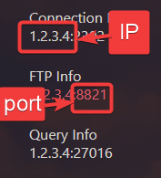
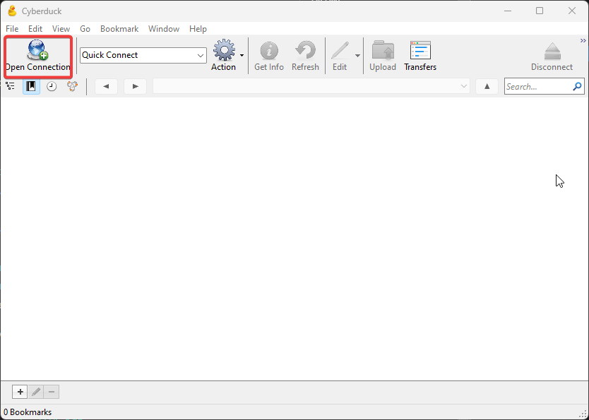
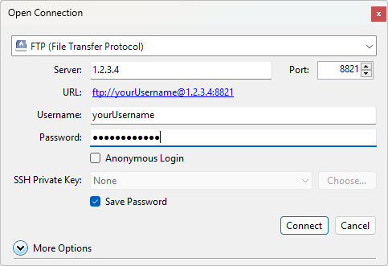
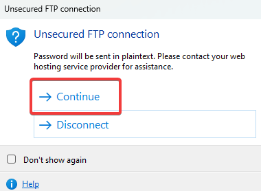
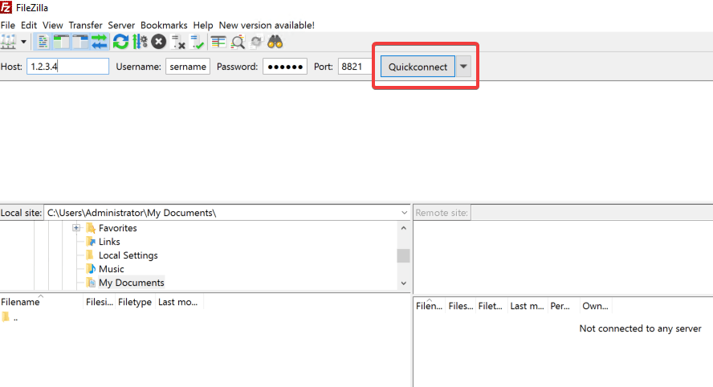
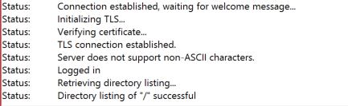
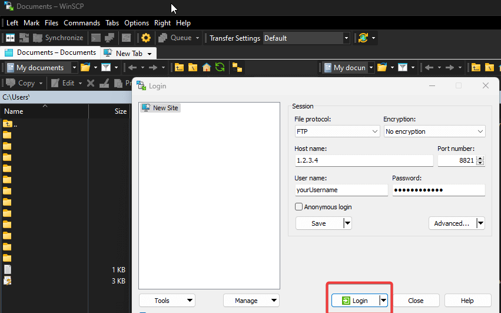

Please note that this guide covers only FTP access for game servers hosted under our <a href="https://gamepanel.fragnet.net" target="_blank">Game Panel (gamepanel.fragnet.net)</a> which we plan on decomissioning in favor of our custom control panel <a href="/docs/fragify/intro">Fragify</a>

If you have a Farming Simulator 19 / 22 server, you can <a href="/docs/games/fs22/manage-files-via-ftp">find the FTP guide here.</a>

-------

We provide full access to your server files for most games through the game panel's integrated file manager and the File transfer protocol (FTP). The integrated file manager is a lightweight solution for simple tasks such as file and folder deletions/renames and light file uploads. FTP is more suited for heavier tasks such as large file uploads (both in size and number) and moving files from one directory to another.

While we provide full access to server files for most games we are hosting, some games are limited or completely inaccessible via FTP or File Manager as per developer demands.


## FTP connection details

-------

To access your server's FTP, you must input the **Hostname or IP address**, **Port**, **Username** and **Password**.

If your server is setup on ```gamepanel.fragnet.net```, FTP details are the following:

    Host : Your game server address  
    **Warning** : Do not include the port after the IP address (I.E 192.168.1.1 instead of 192.168.1.1:25565)  
    Username : Your game panel username  
    Password : Your game panel password  
    Port : Can be seen on the game panel 



## Connecting to your FTP

-------

You can use any FTP client that you are comfortable with. However, if you don't know which FTP client to use, you can check this table for
compatibility of most popular FTP clients:

| Software | Windows | Mac | Linux |
|----------|---------|-----|-------|
| [Cyberduck](https://cyberduck.io/) | ✔️ | ✔️ | ✔️ |
| [WinSCP](https://winscp.net/eng/download.php) | ✔️ | ❌ | ❌ |
| [FileZilla](https://filezilla-project.org/) | ✔️ | ✔️ | ✔️ |

You can follow the steps to access and manage your server files for most game servers using FTP clients such as:

## Cyberduck

1. Download and install Cyberduck here: [Download Cyberduck](https://cyberduck.io/download/)

2. Click on ```Open Connection`` button in Cyberduck.



3. Input the FTP details 



4. The pop-up message regarding unsecure connection will appear and you can click on ```Continue``` option.



Afterwards, if all the details were correct, you should see the folder with the IP and port of your server.

## Filezilla

1. Download and install FileZilla here: [Download FileZilla](https://filezilla-project.org/download.php?type=client)

2. Connect to your FTP account using the FTP details and click on "Quick connect".



3. Afterwards, if all the details were correct, you should see the folder with the IP and port of your server and the following will appear in console:



## WinSCP

1. Download and install WinSCP here: [Download WinSCP](https://winscp.net/eng/download.php)

2. Fill the fields with your FTP details and click on **Login** button. 



*** Be careful when you type login information as you may get a 5 minutes ban if you attempt to login with the wrong credentials repeatedly. In that situation, simply disconnect and wait 5 minutes before trying again ***

## Uploading and downloading files or folders

------

FTP is particularly useful for backing up your server files, or uploading plugins/worlds/settings onto your server.  
  
Once connected to your FTP account, server files will be listed on the right side of the screen, whilst your computer's files will be listed on the left side.  
You can upload, download, and move files from your computer to your server and vice versa, as well as within the server's folders.  
  
Alternatively, you may right click on the relevant file or folder and hit the "Download" or "Upload" button.