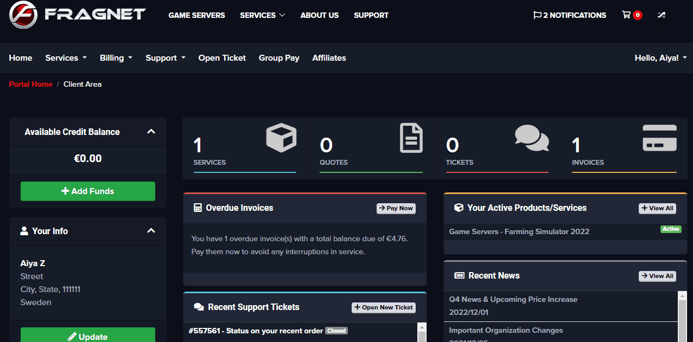

# How do I cancel my service?

> NOTE: **Should you have any issue with your Fragnet Service(s), we encourage you to contact our support team to get assistance before considering a cancellation:** [Create a ticket](https://clients.fragnet.net/supporttickets.php)
  
To cancel your current service, you have with us, please follow the below steps:  
  
1) Login to your account at [https://clients.fragnet.net/clientarea.php](https://clients.fragnet.net/clientarea.php)  

2) Click on "Services" => "My Services".
Here you will see a list of all services you have with Fragnet.  

3) Click on the active service that you would like to cancel. 

4) Press the "Request Cancellation" button. 

5) On the next page, you can provide us with some feedback and select the cancellation type. Please see below for details regarding the available options.  
  
>Immediate = Terminates your server within the next 24 hours.

>End of billing period = Keeps your server online until you have reached the end of your current billing period.

  
***IMPORTANT NOTE for PayPal***
> Please check if you have any active PayPal subscriptions setup to pay automatically for your services with us. You must cancel them manually or contact us to check it for you before the cancellation.

***IMPORTANT NOTE for saved cards***
>If you have any saved credit card in payment methods, the server will be automatically renewed unless you submit a cancellation request. 

**Remember that cancelling the active service does not mean you will get an automatic refund! Contact us via ticket to see if you are eligible for a refund.**