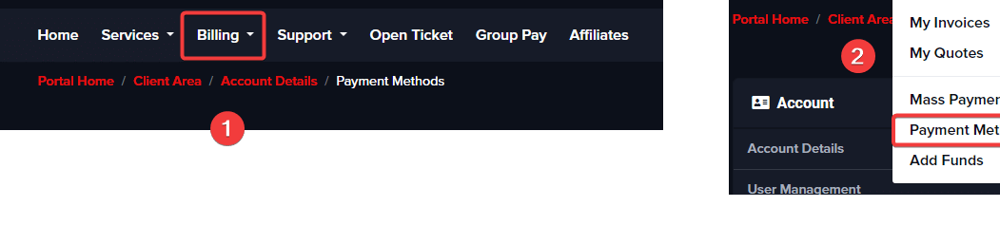

# How do I renew my services? 

If you want to renew your contract, you must pay up-front the next contract period.
Before the end of each rental period, a new invoice will be generated 2 weeks before the due date, and you will be notified by an email which reminds you about the renewal.

If you intend to keep the service, that invoice must be paid. If the invoice is not paid on time, your server will be suspended at the end of the billing cycle. The service will be suspended for up to 14 days before it gets terminated (deleted beyond any recovery).

Suspension gives the opportunity to the clients to renew an expired game server and still get the same service as before, with all files intact. 
Our billing system will automatically send reminder emails before and after the suspension. There will be three reminders in total before and after the suspension!

If you don't intend to keep the service, disregard these emails and check if you have any saved credit card or an active PayPal subscription.

> **_NOTE:_**  Keep in mind that we reserve the right to delete the files earlier than within 14 days

If you need any help with the server renewal, don't hesitate to contact us so we can assist you.

## Automatic renewal of service

You can make a PayPal subscription for the renewal of your active service, or you can also go to ```Billing``` => Payment Methods to save a credit card which will be used for the renewal invoices.

