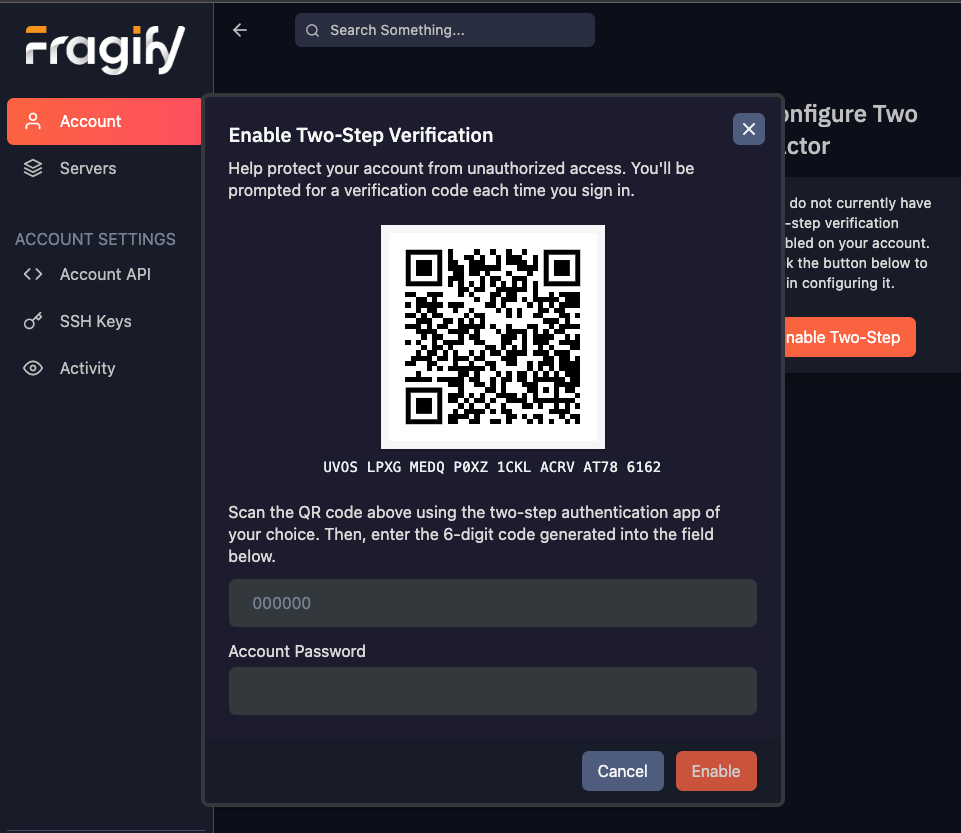

# 2-Factor Authentication

:::info
Take caution and only enable 2FA on a trusted device. If you lose access to this device, you will not be able to access your account.
:::

## Enabling 2FA

To enable 2FA, head over to the [**Account**](https://panel.fragnet.net/account) tab and click the **Enable Two-Step** button.

You will then be presented with a QR code and a code that you can use to set up 2FA on your device. We recommend that you use an application like [Authy](https://authy.com/) to scan the QR code and generate the 2FA code.

Once you've installed the Authy app, clikc on the + button and select **Scan QR Code**. You will then be prompted to scan the QR code.

:::note
If this is the first time you are using Authy, you will now be prompted to set a `Backup Password`. This password is used to recover your account if you lose access to your device. Make sure to write this down and keep it in a safe place.
:::

Now pick a name for your 2fa account and click **Save**.

You will then see the generated 2FA code. Enter this code into the panel, along with your current Fragify account password and click **Enable**.

If 2FA was enabled successfully, you will see the following message:

Congratulations! You have successfully enabled 2FA on your account.