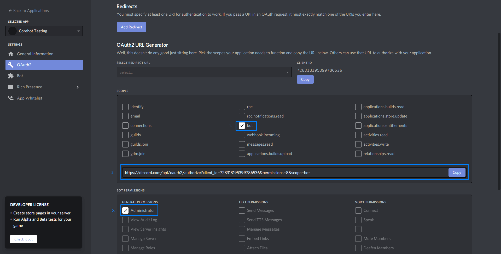

Corebot offers 600+ features, allowing you to replace many bots with one.

:::note
Our offering does not come bundled with a Corebot license. You will need to purchase a license from either [BuiltByBit](https://corebot.dev/mcm) or [Polymart](https://corebot.dev/polymart).
:::

## Prerequisites
When you have purchased Corebot from one of the above websites, you should have the option to download the latest version.

## Creating your Discord bot
:::warning
Your Discord account must have a verified email address to be able to create a bot application/account.
:::


1. Go to the Discord Developer Portal: https://discordapp.com/developers/applications

2. Click on the **New Application** button.


3. Enter a name for your bot and click on the **Create** button.


4. Click on the **Bot** tab on the left-hand side of the page.


5. Click on the **Add Bot** button.


6. Click on the **Yes, do it!** button.


7. Here, you can change the bot's profile picture and account name. Be sure to enable ALL of the the Privileged Gateway Intents including "PRESENCE INTENT", "SERVER MEMBER INTENT", and "MESSAGE CONTENT INTENT". If you don't, the bot will not work properly.


:::info
Additionally, for security measures, disable "Public Bot". This will prevent other people from inviting your bot to their server!
:::

## Inviting your bot to your server

1. Click on the **OAuth2** tab on the left-hand side of the page.


2. Select the bot AND applications.commands scopes and Administrator bot permission, then go to the link that is generated.


3. Select your server and click the Authorize button.


## Securing your bot

1. Go back to the **Bot** tab on the left-hand side of the page.


2. Disable **Public Bot** and enable **Reqiures OAuth2 Code Grant** then save your changes


## Getting your license key
You will now need to verify your purchase with the Corebot team in order to receive your license key. You can do this by:

1. Joining the [Corebot Discord](https://corebot.dev/support) server.
2. React with the ✅ emoji on the welcome message in the `#verify` channel.
3. Navigate to the `verification` ticket category.
4. Provide the information requested by the bot to get your license!

## Configuring your bot
You should now have a license key and a zip file containing the Corebot files. Let's start installing them!

Navigate to your Fragify's server [File Manager](../../fragify/file-manager.md) and upload the zip file by dragging it into the file manager or using the "Upload" button.

Then extract the zip file by clicking on the **Unarchive** button.


You should now see a `configs` folder. Navigate to this folder and click on the file named `config.yml`.

```yaml
Token: "BOT-TOKEN-HERE"
Key: "BOT-KEY-HERE"
```

Add your **Discord Bot Token** under `Token` and your **Corebot License Key** under `Key`.

Feel free to change any of the configuration options below and start your bot!