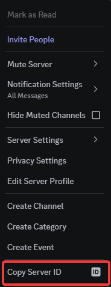

# Setting up your DiscordGSM bot

This guide will include information on how to enable developer mode in your Discord account, generate token for your bot smf get a guild ID (server ID) to properly setup DiscordGSM.

## Enabling Developer Mode for your Discord account

1. Launch your Discord application and click on the icon of Settings next to your profile.


2. Navigate to **Advanced** option under `App Settings` and toggle on **Developer Mode** function.


## Generate Discord Bot Token

1. Go to https://discord.com/developers/applications and click on **New Application** button on top-right side.
Name the bot and agree on Terms of Service.  Afterwards, click on **Create** button.


2. You will be redirect to **Bot** page and you can click on **Reset Token** button to get a new token for your bot. Copy the token that you have seen 


3. Login to the [Fragify panel](VAR::FRAGIFY_URL) and select your DiscordGSM server.

4. Go to **Configure** option on the left-side menu and paste your token in **Discord Bot Token**.


5. Now, we will also need to have Guild ID (Server ID) and you can obtain it by going to your Discord application => right-click on the server that you would like the bot to send messages to and click on **Copy Server ID** option.



6. Paste the Guild ID in **Whitelisted Guilds** which is located on Fragify panel in **Configure** options. 


7. Afterwards, you can try to start the server and you will see the following error:
```
discordgsm The client does not have the applications.commands scope in the guild. 403 Forbidden (error code: 50001)
``` 
In this case, go to the URL provided on startup of your bot. Click on **Continue** button and **Authorise** bot. 


8. Afterwards, you can use list of commands from here: https://discordgsm.com/guide/commands and Game IDs provided here: https://discordgsm.com/guide/supported-games