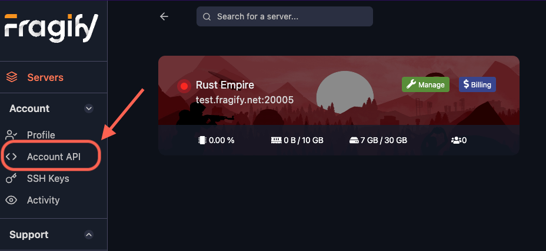
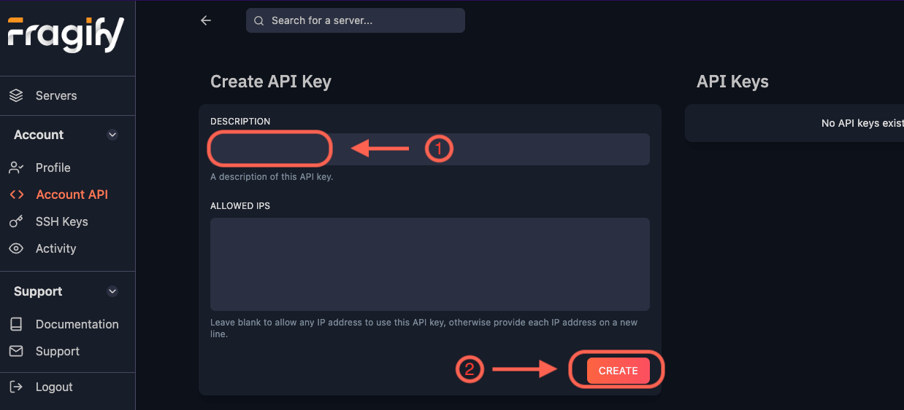

Once logged in to your Fragify account, you can generate an API key by heading over to the **Account API** tab.

On the **Account API** page, you can generate a new API key by providing a description (1) for the key and clicking the **Create** button (2).

After the API key is generated, make sure to copy it and store it in a safe place. You won't be able to see it again.
