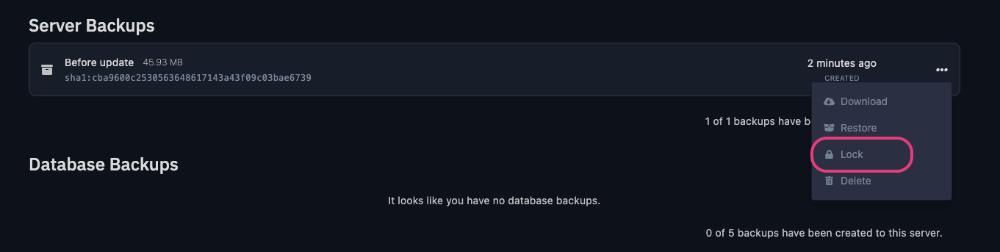
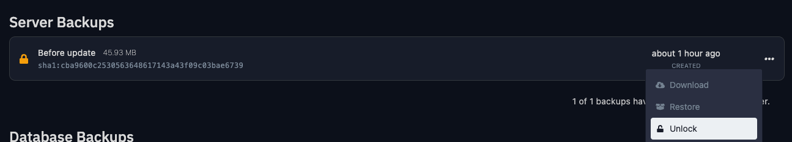

## Locking
You can lock an existing backup of your server at any time by heading over to your server's **Backups** tab and clicking the **Lock** button next to the backup you want to lock.

This feature is useful if you want to prevent a backup from being deleted or overwritten when you have a backup schedule enabled. By default, the scheduler will delete the oldest backup when creating a new backup if the maximum number of backups has been reached. Locking a backup will prevent it from being deleted by the scheduler.

## Unlocking

If you have locked your backup, you will need to unlock it before you can delete it. You can do this by clicking the **Unlock** button next to the backup you want to unlock.

