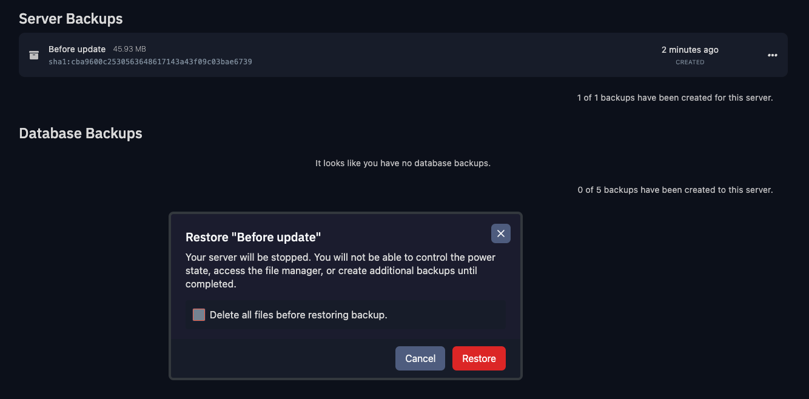

You can restore a backup of your server at any time by heading over to your server's **Backups** tab and clicking the **Restore** button next to the backup you want to restore.

:::danger
Restoring a backup will overwrite all files and configurations on your server. This includes any changes you have made to the server since the backup was created.
:::