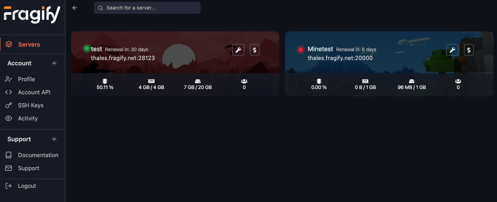
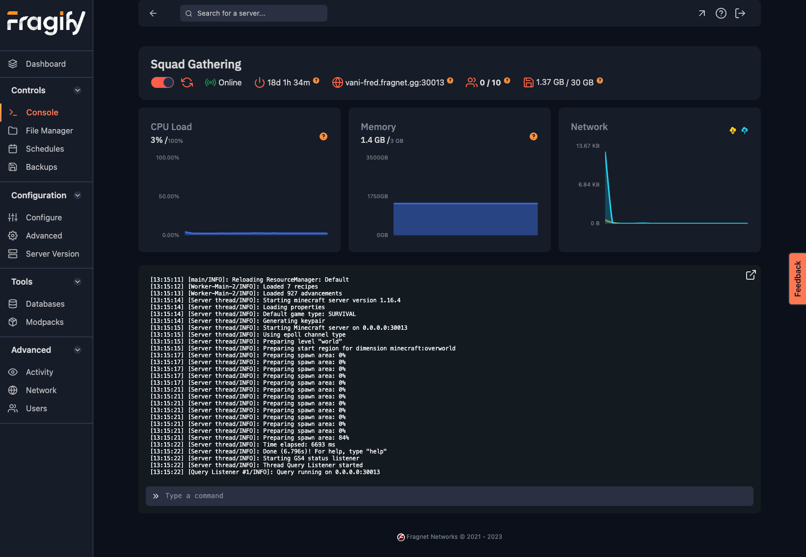
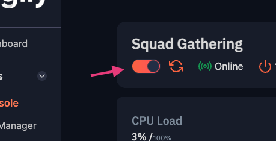
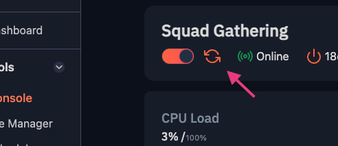

# Basic Controls

## Accessing the panel
Once you have purchased a server, you will receive an email within a few minutes with the subject **Account Created**. 

This email includes a link to set a new password for your account. Note that this link only lasts for 1 hour. If you do not set a password within this time, you will need to use the [**Forgot Password**](https://beta.fragify.net/auth/password) link on the login page to reset your password.

## Dashboard
The dashboard is the first page you will see when you log in. It will show you a list of all your servers, as well as some basic information about them.

## Server Management
Once you navigate to one of your servers, you will be percented with the following page, where you can manage your server, view live usage stats as well as the console.

### Power Controls
You can start/stop your server by using the slider at the top element of the page:

You can restart your server by clicking the **Restart** button:

