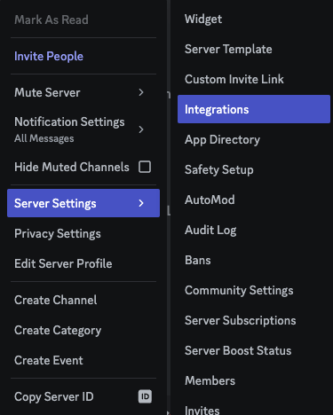
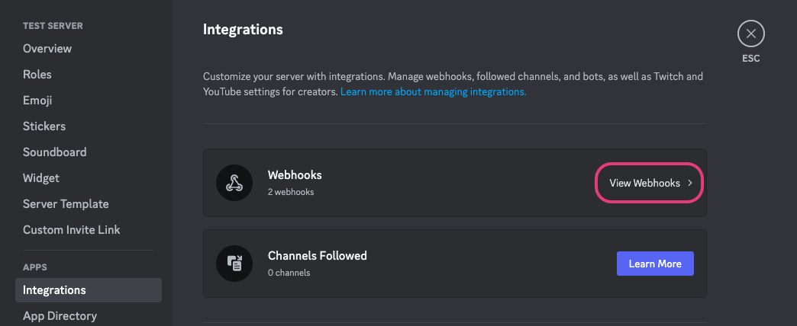
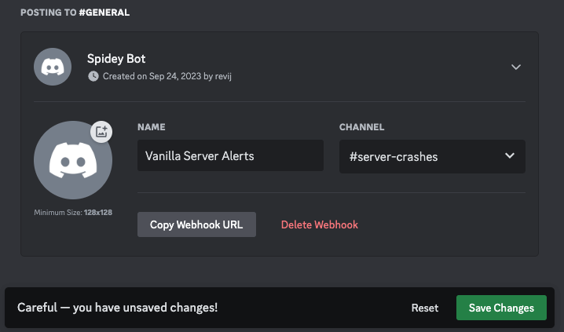

# Crash alerts

Fragify monitors your server's uptime and in case your server crashes without you restarting or stopping it, it will automatically log the last few lines of your console's messages along with some other useful information.

## Viewing crash logs

If your server has recently crashed, you can view the crash log by navigating to the **Activity** tab of your server.  

## Sending crash logs to your Discord server

You can also configure Fragify to send any crash events to your Discord server.

1. To do this, start by right clicking on your server and select **Server Settings** -> **Integrations**.

2. Next, if you already have other webhook integrations set up, you should see a **View Webhooks** button. Otherwise, click on the **Create Webhook** button.

3. Click on **Create Webhook** again where you will be prompted to enter a name and a text channel for your webhook.
You can name it anything you want.  

4. Click on **Save Changes** and then **Copy Webhook URL**.

5. Navigate back to your Fragify server -> **Advanced** and scroll down to "Crash Detection Options". You can paste your webhook URL there and click on Save.
