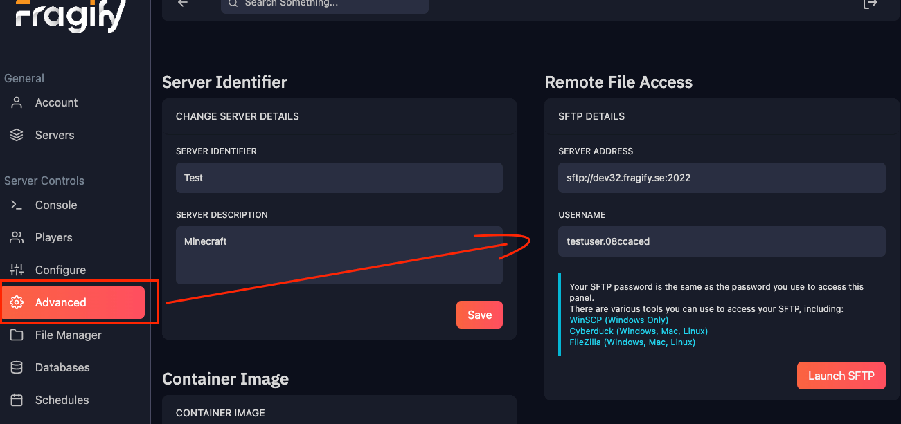
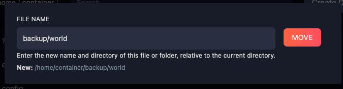

# File Manager / SFTP

## SFTP
SFTP is a secure file transfer protocol that allows you to transfer files between your computer and your server. It is a more secure alternative to FTP, which is why we use it by default.

### Connecting to SFTP
There are various tools you can use to access your SFTP, including:

| Software | Windows | Mac | Linux |
|----------|---------|-----|-------|
| [Cyberduck](https://cyberduck.io/) | ✔️ | ✔️ | ✔️ |
| [WinSCP](https://winscp.net/eng/download.php) | ✔️ | ❌ | ❌ |
| [FileZilla](https://filezilla-project.org/) | ✔️ | ✔️ | ✔️ |

You can then locate the SFTP details for your server by navigating to the **Advanced** page of your server:

## File Manager
The file manager is accessible from the left-side menu and it allows you to:

- Upload files by dragging and dropping them (Note that you cannot upload folders).
- Create directories or files.
- Edit files with syntax highlighting.
- Rename or move files.
- Download files.

#### Moving Files
To move a file or a folder, click on the **...** button after it and select **Move**.  
You will then be presented with a modal where you can select the destination directory.  

**Example:** If you would like to move the "world" folder to a folder called "backup", you would type the following:
