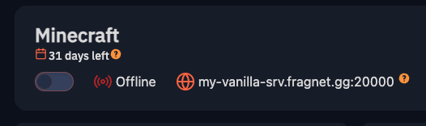

Subdomains allow you to use a custom domain when connecting to your server.

This is especially useful if you have a minecraft server and don't have the default port assigned to it.

## Creating a subdomain

To create a subdomain, head over to your server's **Advanced** tab and scroll down to the **Subdomain** section.

Simply, fill in the subdomain you want to use, select one of the available domains and click the **Save** button.

:::info
Subdomain/DNS changes can take up to 24 hours to propagate - depending on your DNS provider.
:::

Any custom subdomains will also show up on the server's information section:

## Removing a subdomain

If you want to remove or change your subdomain, simple navigate back to the **Advanced** tab and click the **Reset** button next to the subdomain.

