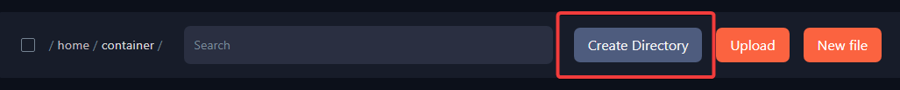

To begin with, you will need to follow the next steps to implement mods on your server.

**Step 1:** Login to the [Fragify panel](VAR::FRAGIFY_URL) and select your 7 Days to Die server. 

**Step 2:** You will find a section named **File Manager** on the left-side menu and click on it.

  

**Step 3:** Now, there will be an option to create a directory that says **Create Directory**. After clicking on it, you will be displayed an input prompt with **Directory Name** where you need to write the name **Mods**.

**Step 4:** After you have created a folder now, you will need to navigate to one of the sites where you can download Mods. Two of the most famous are [7daystodiemods](https://7daystodiemods.com/) and [NexusMods](https://www.nexusmods.com/7daystodie).  

**Step 5:** Find a mod you want to enable on your server and download it to your PC. After the download is completed, make sure to save it somewhere where the mod is easily reachable.  

**Step 6:** After downloading all the mods, you can drag and drop them in the **Mods** folder or use **Upload** button.

**Step 7:** Select the archive of the mod that you have uploaded and click on **...**  , then select option **Unarchive**.

**Step 8:** Restart your server, so your adjustments are in place, and you are good to go!