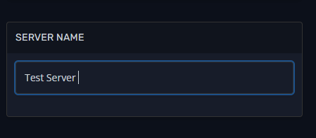

This will be a guide on how you can change the name of your server.
  
**Step 1:** Log in to your account on our [Fragify panel](VAR::FRAGIFY_URL) and find your 7 Days To Die server.

**Step 2:** Go to **Configure** on the left-side menu.  

**Step 3:** Find **Server Name** variable and input the name.   

**Step 4:** Restart the server and server’s name will be changed.
