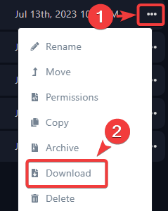
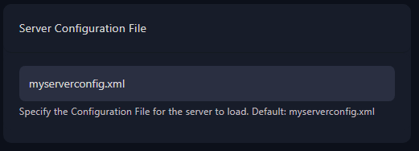

Before making any configuration file changes, you should always create a backup of it.  
To create a backup, follow the next steps:

## Create a backup of myserverconfig.xml

**Step 1:** Login to the [Fragify panel](VAR::PANEL_URL) and select your 7 Days to Die server. 

**Step 2:** Go to **File Manager**  

**Step 3:** Locate a file named **myserverconfig.xml**  

**Step 4:** Right-click on the file and press **Download**  

**Step 5:** Save the file somewhere easy to remember.

Now when you want to edit the config file go to **File Manager** and select **myserverconfig.xml**. This will open editor window and you can change values of variables to your preferences. Don't forget to click on **Save Content**.
Next to every command in the file there will be an explanation about the property you want to change.

## Custom Configuration File

**Step 1:** If you have your own configuration file that you wish for the server to load, you can upload it by going to **File Manager** and clicking on **Upload** button. Alternatively, you can use drag and drop function. 

**Step 2:** Now, you can navigate to **Configure** option on the left-side menu.

Find **Server Configuration File** variable and set it to the name of the config file that you have uploaded.

**Step 3:** Restart the server for the changes to be applied. 