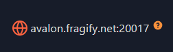
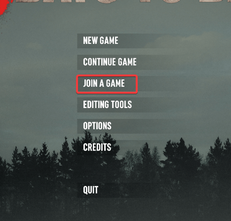
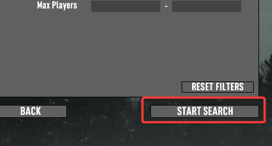
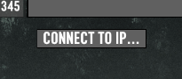
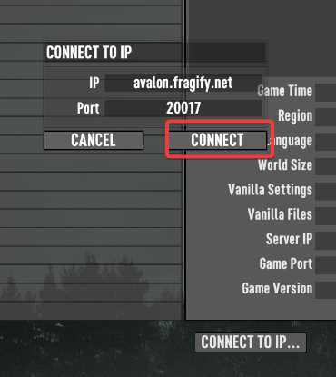
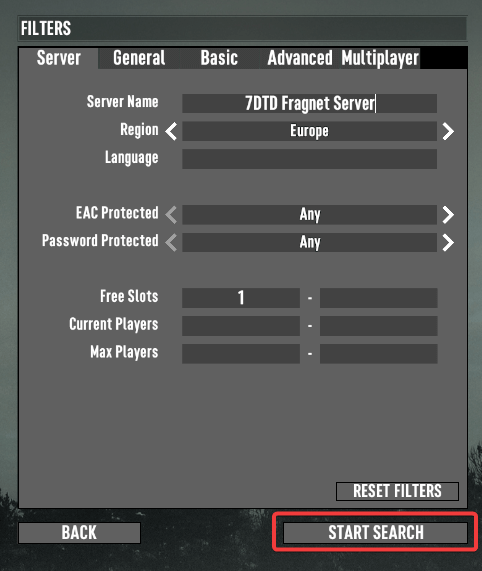
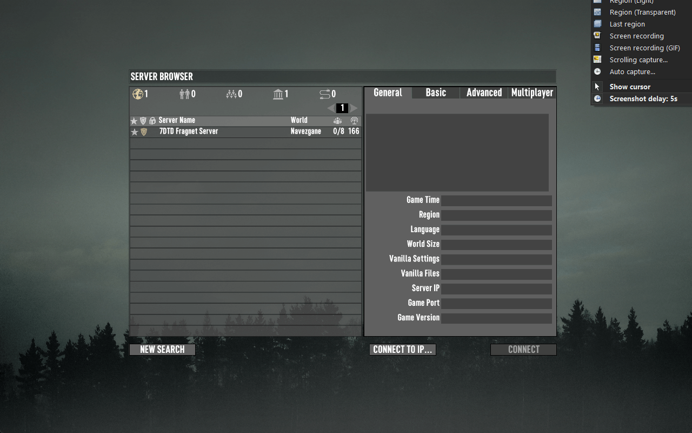

This guide will show you 2 ways to connect to your 7 Days To Die server.

## Via Direct Connect

1. Before attempting to connect  to your server,  you will need to find the server's IP address". The IP address can be found by going to your [Fragify panel](VAR::PANEL_URL) and selecting 7 Days to Die server. On the console page, you will see IP address on which you can click on to copy it on the clipboard. 



2. Launch the game and go to ```Join a Game``` option in the main menu. 



3. You can click on ```Start Search``` button ob the bottom-right corner.



4. Navigate to ```Connect to IP...``` button and input IP address/port.



5. Click on ```Connect``` and if IP address/port were correctly input, you should be connected to your server. 



## Via Server Browser in-game

1. Launch the game and go to ```Join a Game``` option in the main menu. 


2. Input the name of your server that you have set in **Configure** option in Fragify panel. If you don't know where to find your server's name, you can check [this article](change-name.md).



3. You should see your server in the browser and connect to it by double-clicking on it.



> If you cannot find server, please double-check if server name and region are set to match your settings in Fragify panel. 