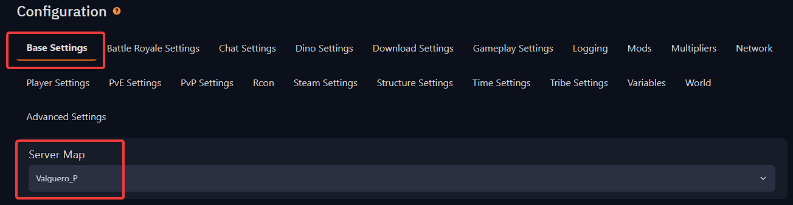

# Changing map on ARK server
You can easily change the map on your server by following the next steps:

**Step 1:**  Login to the [Fragify panel](VAR::FRAGIFY_URL) and select your ARK server.

**Step 2:** Navigate to the **Configure** option on the left-side menu.

 

**Step 3:** In `Base Settings`, find **Server Map** and select to the map you would like the server to load.

**Step 4:** Restart your server for the changes to be applied, and it should be running with the selected map.