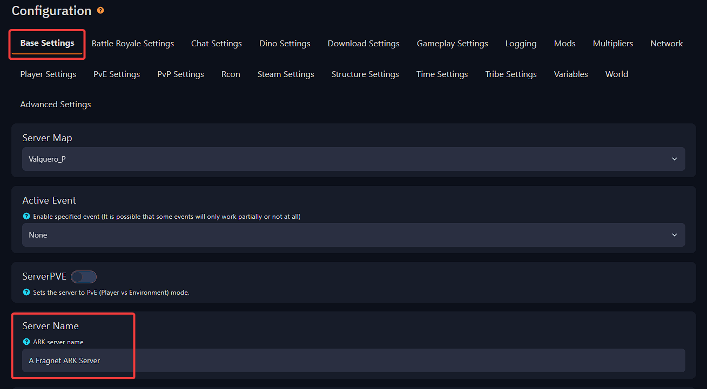

# Change ARK server's name
To change the name of your server, follow the next steps.

**Step 1:** Login to the [Fragify panel](VAR::FRAGIFY_URL) and select your ARK server.

**Step 2:** You will see on the left side several sections you are looking for **Configure** option.

  

**Step 3:** Find **Server Name** in `Base Settings` and input the name you would like the server to use. 

**Step 4:** For these changes to be reflected, restart your server. The server name has been successfully changed now. 