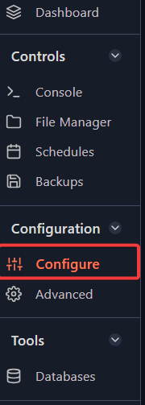
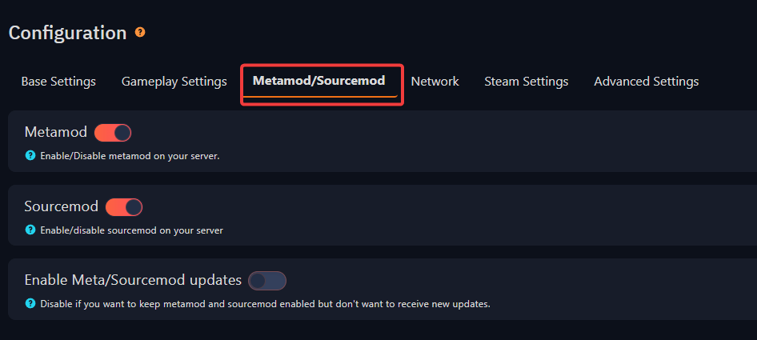

You can easily install the latest version of MetaMod and SourceMod on the Fragify panel!

Follow these steps:

1. Log in to [Fragify panel](VAR::FRAGIFY_URL).
2. Select your CS:GO server and go to **Configure** option on the left-side menu.



3.  Select **Metamod/Sourcemod** tab and click on slider next to `Metamod`, `Sourcemod` to enable them. 



You can also enable automatic updates of metamod/sourcemod on the server's startup.

4. Restart your server and the latest version of sourcemod/metamod will be installed on your server.
  

Verifying the installation
==========================

To verify that the installation of Sourcemod is functioning as intended, connect to your CS:GO server and type "meta list" in the client console.

If the MetaMod: Source and SourceMod are correctly installed, you should see output similar to the following results:

  
```
meta list
Listing 1 plugin:
[01] SourceMod (1.8.0.6046) by AlliedModders LLC
```