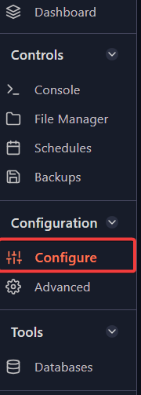

In order to host Steam Workshop Maps easily on your servers, there are some things that we need to prepare first.  
  

##  Acquiring Steam Web API Key

To authenticate any requests from the server to the Steam Workshop, we need the API Key. This can be easily created on official Steam website: [API key request](https://steamcommunity.com/dev/registerkey).  
Simply go to the website, fill in the Domain Name, agree to Steam Web API Terms of Use and press Register.  
  

## Steam Workshop Collection

### Create your own Collection

With creating your own Steam Workshop Collection, you have full flexibility of what you want to host on your server. 

Keep in mind that you must be logged in to Steam before doing this.

  
In order to create your own Collection follow these steps:

*   Go to the [Collections Tab](https://steamcommunity.com/workshop/browse/?appid=730&section=collections) in the CSGO workshop,
*   Create Collection by pressing a blue button labeled "Create Collection", and follow the instructions to successfully create your collection
*   Start adding maps from [CSGO Workshop](https://steamcommunity.com/workshop/browse?appid=730&browsesort=trend) to your collection by opening map page and pressing Add to collection  
    

Once you are done adding maps to your collection,  it's time to Publish it. Keep in mind that your collection needs to be public so that server can access it.

You can access your collection by navigating to "Profile" → "Content" → "Collections"

  

Finally, the ID of the collection is required, which can be read from the navigation bar of the web browser. You should see a URL similiar to this: [http://steamcommunity.com/sharedfiles/filedetails/?id=1](http://steamcommunity.com/sharedfiles/filedetails/?id=433528668)23456789\. The ID of the collection would be the number after "?id=".  

### Using an existing Collection

If you wish to use an existing Collection, you only need the ID of the collection. Open desired collection via browser and in the URL you will see "?id=", numbers after that part of the URL are Collection ID.  
  

### Setting your server for workshop maps

If the necessary steps from above are successfully completed, it's time to set workshop maps on your server!  
This can be easily done on the Fragify panel by following these steps:

1.  Login to [the Fragify panel](VAR::FRAGIFY_URL).

2.  Select your CS:GO server and go to **Configure** option on the left-side menu.

3.  Go to **Steam Settings** tab and input the Workshop Collection ID in "Workshop Collection".

After you server is restarted it will start downloading all maps from your collection and you should be all set!
