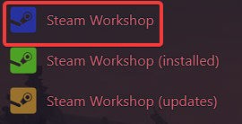
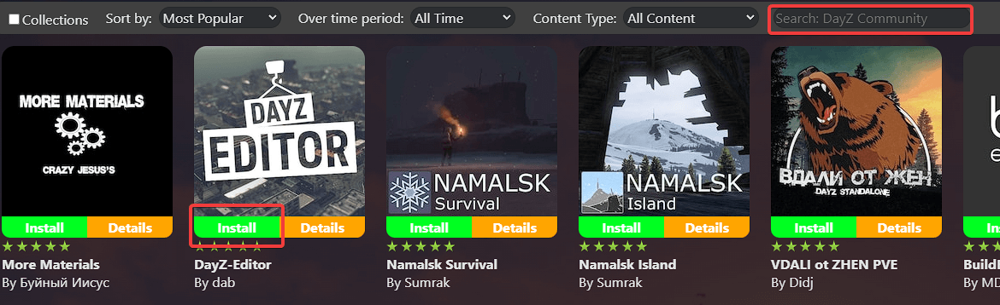
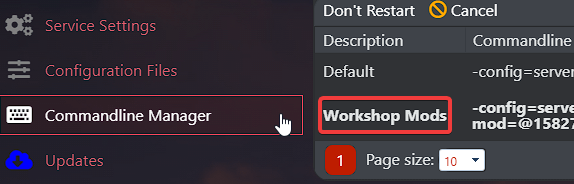

# Installation and enabling mods on your DayZ server

This guide will show you how to add mods to your DayZ server correctly.
Before you proceed following the next steps, just in case something goes wrong, it will be good if you have a backup. To create a backup, you can use this article on our knowledge base: [How to create a backup for DayZ server](/games/dayz/make-backup)

Great. Now that you have created a backup let's focus on installing mods.

## How to install mods on your server

After you login to the game panel, you will find three sections on your game panel that will help you move through mods. Three sections are **Steam Workshop, Steam Workshop (installed), Steam Workshop (updates)**. 
1. To find mods, go to **Steam Workshop** and, in the **Search box**, write the mod's name.  
   

2. After finding the desired mod, click the **Install** button.  

Proceed with these steps for all mods you want to install on your server.

> Please note that after installation of mods on your server, you will also need to enable them.

## How to enable mods on your server

1. Navigate to **Commandline Manager** and select `Workshop Mods` commandline. 

2. Restart the server, and the server will be running if everything is installed correctly. 

