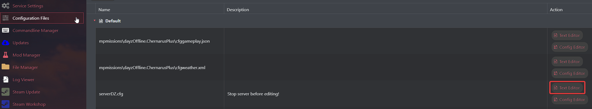
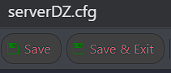

# Changing basic settings of your DayZ server

Before playing on your DayZ server, you may want to change some settings, such as the server's name, password, or even the admin password. To change these properties, you will need to follow the next steps.

Ensure the server is stopped before even trying to access **serverDZ.cfg** file. Otherwise, it is not possible to edit the file and save the changes in it. 

  
1. Log in to your account on our [game panel](VAR::OLD_PANEL_URL).

2. Head out to **Configuration Files**.

3. After you see a list with all the configuration files you can edit, you will notice one named **serverDZ.cfg**.

4. On the right of the name serverDZ.cfg, you will see the **Text Editor** button. Go ahead and click on it. 



5. Once the text editor is opened, you can change the following properties.
```
hostname = "DayZC Server"; // Server name
password = ""; // Password for connection to the server
passwordAdmin = "vn1d4"; // Password to become server admin  
motd[] = {"Your Message Of The Day"}; //// Message of the day displayed in the in-game chat
motdInterval = 30; // Time interval (in seconds) between each message
```
>Full list of properties can be found here: https://community.bistudio.com/wiki/DayZ:Server_Configuration

6. After changing the desired properties, press **Save & Exit**. 



7. Start your server from the game panel, and the server will load the values you have set.
