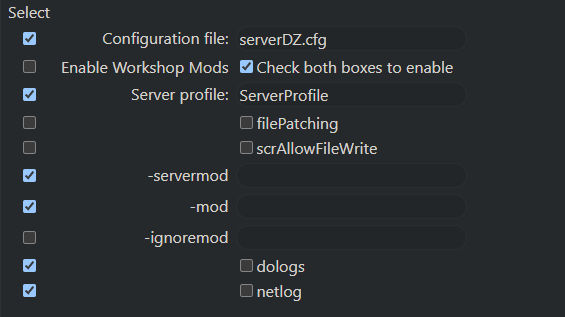

# Creating a custom commandline for your DayZ server

Generally speaking, custom commandline is required when you need to specify the mod order manually, as certain mod dependencies need to be loaded first for mods to work correctly and for the server to be able to start.  
To create a custom commandline in DayZ, you will need to follow the next steps:

**Step 1:** Log in to your account on our [game panel](VAR::OLD_PANEL_URL) and find your service.   

**Step 2:** Go to **Commandline Manager**.  

**Step 3:** Press on **Custom Commandline** and hit **+New**.  

**Step 4:** You will be displayed a list with many checkboxes. First, you will need to name your custom commandline, and you can do this next to **Description** by writing the name of your commandline (ex. DayZ custom commandline)  

**Step 5:** On to the checkboxes you will need the following checkboxes as shown on a screenshot



**Step 7:** Fill in the required details, and once you are done, press **Save** button on top.  

**Step 8:** On the right side of the custom commandline, you will see two buttons **Edit** and **Select**. Press **Select** option and the newly created custom commandline will be selected.

>In the mods input box, you must write mod ID. To find the mod ID, press on the tab of the already opened mod Steam page, select the URL, and copy the number as shown on the screenshot:  . Mods are listed in the commandline always start with `@` and end with `;` except the last one.
Here is an example:
```
@1559212036;@1590841260;@1646187754
```
When creating a custom commandline and placing the mod IDs, ensure they are correctly placed in this format. Otherwise, the server will have an issue starting. This goes for both the -servermod and -mod option.

