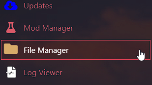
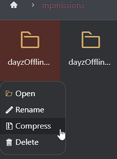
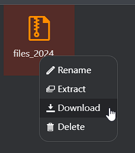

# Create backup of persistence of your DayZ server

Creating backups for your DayZ server can often help you if you decide to install some mods or make adjustments, in which case you will have a backup to revert to.
To create a backup, you will need to follow the next steps.

**Step 1:** Log in to your account on our [Gamepanel](VAR::OLD_PANEL_URL) and find your service.

**Step 2:** Go to **File Manager** on the game panel.

**Step 3:** Find the folder named **mpmissions**, right-click on the mission your server uses (by default dayzOffline.chernarusplus) and click on the **Compress** option. 

**Step 4:**  After the compressed folder, find it in the file manager, right-click on it again, and click on **Download** option. 

**Step 5:** You have successfully created a backup for your server.