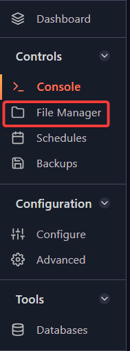

# Adding admins to your Don't Starve Together server

Adding admins to your Don’t Starve Together server requires creating an **adminlist.txt** file at a specific location.

Let's start by getting your **Klei_ID**. There are 2 ways to do this:

## Getting your Klei_ID

### Method 1

1. Connect to your server and type `c_listallplayers()` in the console.

2. You will see a list of players connected to the server. Find your name and copy the **Klei_ID**.

### Method 2

1. Go to [Klei Entertainment](https://accounts.klei.com/account/game) and log in with your Steam account.

2. Once logged in, you will see your **Klei_ID**.

>

## Creating the adminlist.txt file

1. Open up your **File Manager** on your game panel. 

2. Go to this directory: `DoNotStarveTogether => config => server`.

3. Once there, click on **New File** located in the upper right corner of the panel.

>

4. The file will open up, paste your `Klei_ID` in the first line and then click on **Create File** in the lower right corner. 

>

5.  It will prompt you to name the file. It’s very important to name it **adminlist.txt**.

6. Afterwards, click on Create File and Start/Restart you server and connect to it.

If successfully done, you should see a star icon near your character portrait:

