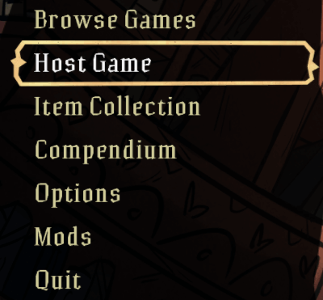

# Adding mods to your Don't Starve Together server

1. Navigate to your **File Manager** on the Fragify game panel and open the **mods** folder, don't forget to stop your server.


2. Find the file **dedicated_server_mods_setup.lua** this is the file that needs to be edited. Open it up and you can see there are 2 possibilities regarding installing mods: Individually or Steam Workshop collections.

We'll make a step-by-step guide on both of these options.

## Adding individual mods to your server

Let's establish what command we need for this to work.

1. Copy/Paste this command in the dedicated_server_mods_setup.lua file:
```
ServerModSetup("ModID")
```
It should look something like this now, the ModID will be changed with the wanted mods ID:


And the easiest way to find it is to go to the mods Steam Workshop page.

Go to the mod you want to download and open its workshop page. Checking out the link of the mod, you can see the last part of it has a mod ID, as shown in the example here:
 
Copy that mod id and paste the id instead of the ModID inside the apostrophes, and click on **Save Content**. 


If you want to add more mods, add another ServerModSetup("ModID") command and do the same with pasting the mod id inside.

2. After the mods have been added. Start/Restart your server, and the mod should be downloading automatically.

Now we need to go and activate the mod and create a `modoverrides.lua`.

3. Head over to `DoNotStarveTogether  => config  => server => Master` and click on **New File** located at the upper right part of the window.


4. Now Copy this text:
```
 return {
  ["workshop-modid"]={
    configuration_options={  },
    enabled=true 
  },
  ["workshop-modid"]={
    configuration_options={  },
    enabled=true 
   }
  }
```
This is an example to enable 2 mods on your server. To add more mods, simply add this text between the last two “}” signs:
```
 ["workshop-modid"]={
    configuration_options={  },
    enabled=true 
  },
```
Note that the last mod should not finish with *coma (,)*.

5. Afterwards, click on Create File, name the file `modoverrides.lua`
and click on Create File again. Now we have created the file that enables the mods.

6. Start your server, and the mods will start downloading and get enabled right on the server.

## Adding a workshop collection to your server
To add a Steam Workshop collection to your server is the same as above. The only difference is the command that is used, so instead of ServerModSetup("ModID") you’re going to use
```
ServerModCollectionSetup("Workshop_Collection_ID")
```
Here is an example for the **dedicated_server_mods_setup.lua** :


## Configuring your mods

Some mods need to be configured, and the best way to do that is to create a config file of the mod via your own game.

1. **Subscribe** to the mod on Steam Workshop and get in your game.

2. Click on **Host Game**. 



3. Go to the mods tab and tick on the mods you want to have. 


4. Select the mod you want to configure and then click on **Configure Mod**.


5. Once done, click on **Generate World**. Now that the game has created the wanted config file, we need to upload it. The file is located at ```Users\%useraccount%\Documents\Klei\DoNotStarveTogether\%randomnumber%\Cluster_1\Master```.
Or you can click on **Manage World**.


And then on **Open World Folder**.


6. Once there, upload the file to the same folder: 
`DoNotStarveTogether => config => server => Master` 

#TODO: Replace with new image


But before that, rename the modoverrides.lua on your gamepanel or delete it if it isn't needed.

If you have a mod that made adjustments to the Caves, all you need to do is go to the Caves folder instead of the Master folder on your PC, and the same goes for the folder on your Game panel.


7. After everything is done, Start/Restart your server, and you have successfully installed, enabled and configured your mod.