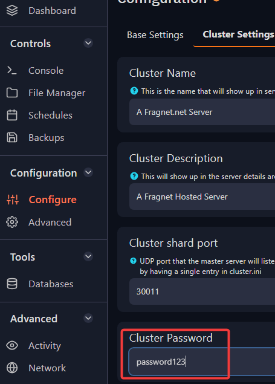
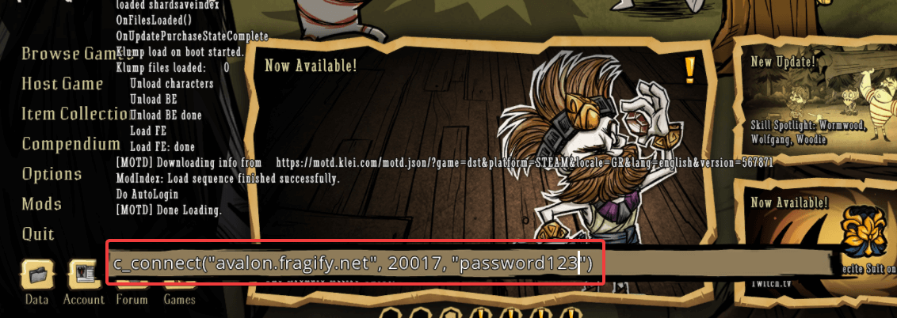
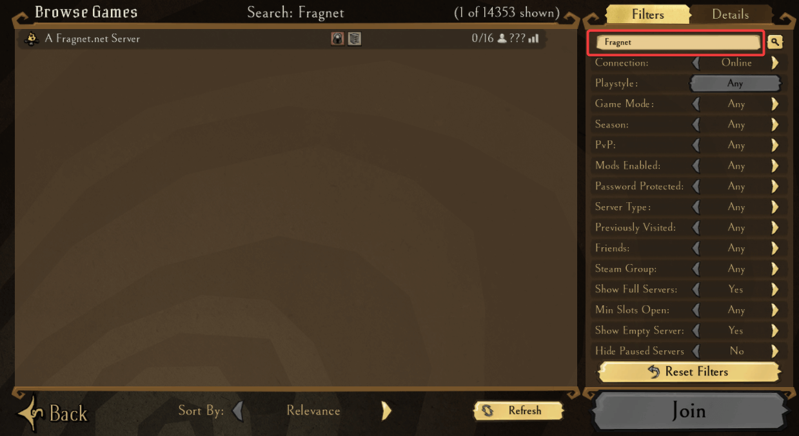

# Finding and connecting to your Don't Starve Together server

This guide will show you 2 ways to connect to your Don't Starve Together server.

## Via Direct Connect

1. Before attempting to connect  to your server,  you will need to find the server's IP address". The IP address can be found by going to your [Fragify panel](VAR::PANEL_URL) and selecting Don't Starve Together server. On the console page, you will see IP address on which you can click on to copy it on the clipboard. The password can be found in `Configure` => `Cluster Settings` => **Cluser Password**.


2. Launch the game and press tilde meg (***~***) on your keyboard for the console to appear.  

3. In the console, you will need to input the following command and replace IP/port/password:
```
c_connect("ip", port, "password")
```


If all the details are correct, after pressing Enter, you should be connected to your server.


## Via Server Browser in-game

1. Launch the game and go to ```Browse Games``` option in the main menu. 


2. Input the name of your server that you have set in **Configure** option in Fragify panel.



3. You should see your server in the browser and connect to it by navigating to **Join** button.

> If you cannot find server, please double-check if server name and game mode are set to match your settings in Fragify panel. 