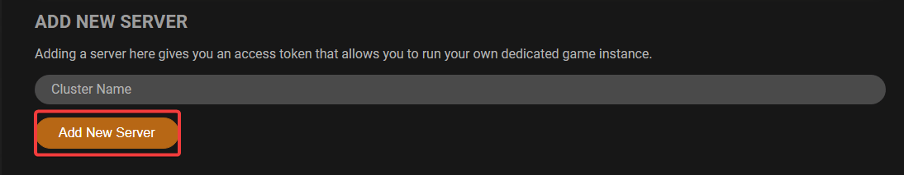
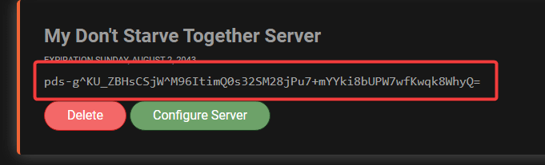
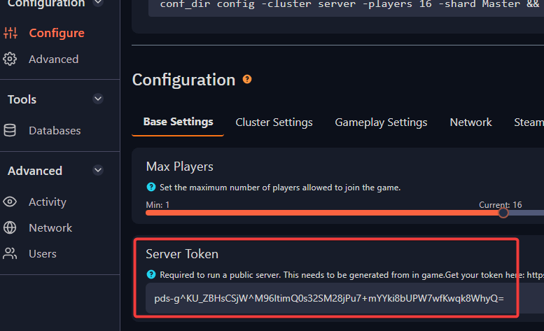

# Generating Cluster Token for your Don't Starve Together server

It is neccessary to generate a token for your server to run and to be accessible in-game. This guide will show you on how to proceed with setup of token for your Don't Starve Together server.

1. Login to your Klei account here: https://accounts.klei.com/login and go to `Games` => `Don't Starve Together`. Alternatively, you can use this link: https://accounts.klei.com/account/game/servers?game=DontStarveTogether

2. You will need to input the Cluster name and click on **Add New Server**.

3. After adding server, you will see the generated token. Copy the token and paste it in `Configure` => `Base Settings` => `Server Token`.

Afterwards, you can start/restart your server for this change to be applied.