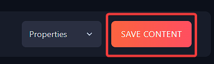

# Setting a password on your Don't Starve Together server
To make your server password protected, all that needs to be done is edit the **cluster.ini** file.

## Via Configuration options

1. Login to your [Fragify panel](VAR::FRAGIFY_URL) and select Don't Starve Together server. Select Configure tab and you can set password in **Cluster Settings**.


2. Restart the server for the changes to be applied.

You can now use the set password for joining your server.

## Via File Manager

1. Head over to your **File Manager** on your Fragify game panel and then go to `DoNotStarveTogether => config => server => cluster.ini`.

2. Open up the **cluster.ini** file and go to the [NETWORK] section and set your password in the following variable:
```
cluster_password = 
```

3. Once added, click on **Save Content** located in the lower right corner. 



5. Start/Restart your server.

That's it! You've now password protected your server.