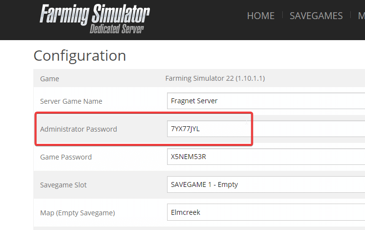
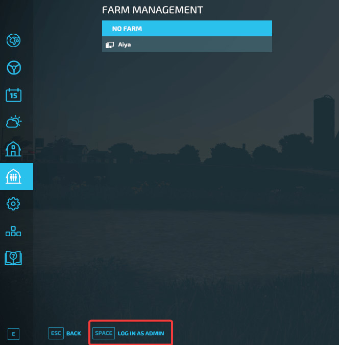
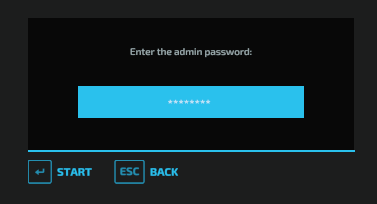

# Become an admin on Farming Simulator 22 server

1. Login to your Farming Simulator 22 Control Panel using the button in your billing account.

2. You will need to input the admin password that you would like to have in ```Configuration``` => ```Admin Password``` option.


3. Start the server and connect to it in ```Multiplayer``` => ```Join Game``` option.

4. Once connected, go to the ```Farm Management``` setting and you will see button "Log in as Admin".


5. After clicking on the button or using the shortcut mentioned in-game, you should see the pop-up window where you can input the password that you have set in Farming Simulator 22 Control Panel previously.


6. Click on ```Start``` button and if you have input correct password, you should be an admin. 
