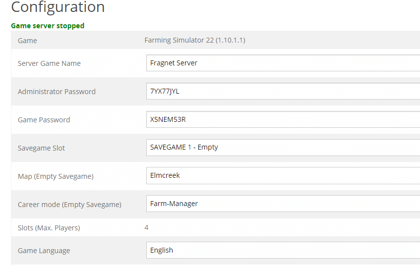
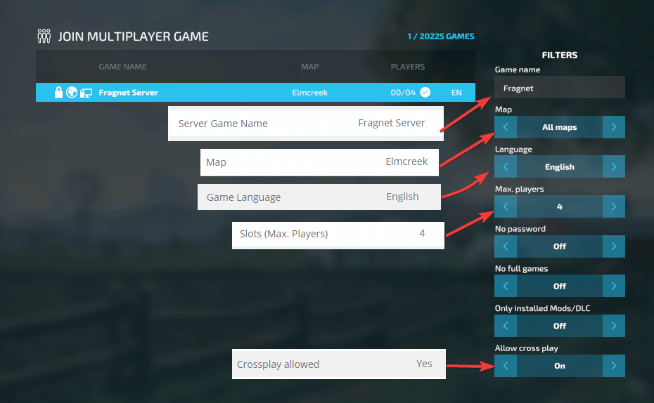

# Finding your Farming Simulator 22 server

1. You will need to take a note of all the configurations made in Farming Simulator 22 Control Panel. 


2. After starting your game, go to ```Multiplayer``` => ```Join Game``` option.

3. Set correct filters to correspond to set options in Farming Simulator 22 Control Panel.


>If you have issues finding your server, check out our overview of issues [here](overview-of-common-issues.md).