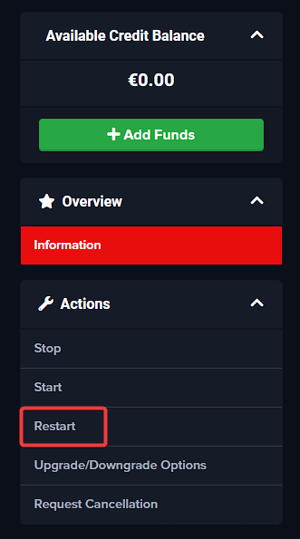
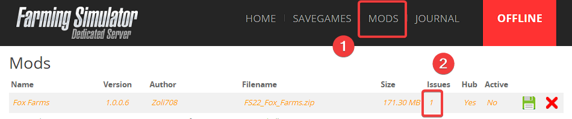
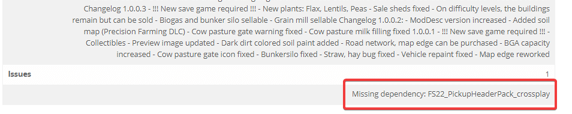

Unable to find the server
-------------------------

Cause of this issue is most often the configuration of the server search filter. You can check [this article](find-server.md) which shows how to find your server.

### Is the server running in the Farming Simulator Control Panel?

With the Farming Simulator, the server backend is started automatically on Fragnet. The server itself must be started via the Farming Simulator Control Panel. It is therefore recommended to log into the Farming Simulator Control Panel and then start the server if necessary.

I can not log in into the Farming Simulator Control Panel
---------------------------------------------------------

Many options are implemented directly via the Farming Simulator Control Panel. Since it is stand-alone software, changes will not be in effect until the server backend gets restarted.

### The password is wrong

Most likely, if you changed the password for your Control Panel that the changes haven't taken place since server backend wasn't restarted. Try restarting server backend from your FS22 Service page so changes can take effect.

### The Control Panel can not be accessed

In this case, the server backend can not be started or is not started. In this case, it is advisable to try starting it up from your FS22 Service page by clicking on active **Farming Simulator 22** service in your [billing area](https://clients.fragnet.net/clientarea.php?action=products) (from the Actions menu) and giving it a try. If this does not help, our support team will be more than glad to help you out. Just submit a ticket and let us handle it!

Common problems with mods and save games
----------------------------------------

### Uploaded savegame not supported. Only Farming Simulator 22 savegames are supported

Most likely you are trying to upload the wrong file structure. Save games can only be uploaded as .zip archive and that .zip should contain all the contents from the savegame folder. Refer to the following article in order to properly zip and upload the save game. You can check [this article](upload-savegame.md) which shows how to upload the savegame.

### I'm not able to upload my mod

You are either uploading the mod in the incorrect format or you have maxed out your Mod Space. Check if you are uploading the mod correctly by referring to the following article [How to manage your Farming Simulator 22 server files using FTP (File transfer protocol)](manage-files-via-ftp.md)

### Stuck on Sync data with other players 

Most common issue on FS22 servers and it's almost always related to either incompatible mod or corrupted save game. We recommend starting a new game with the same mods, if the issue still occurs you should start removing mods from your server in order to find which one is causing this issue. 

### Cannot deactivate or uninstall mod

If you are unable to deactivate or delete an active mod from the server, this means that the mod is a dependency for another active mod on the server. In this case, the other mod in the server has to be deactivated first. 

### Cannot activate mod or start server with the mod map

Usually, this means that mod requires another mod as it dependend on it. In this case, you will need to install and activate the dependencies. To see what dependencies are missing, you will need to check the issues of the mod in **Mods** tab. See example:

