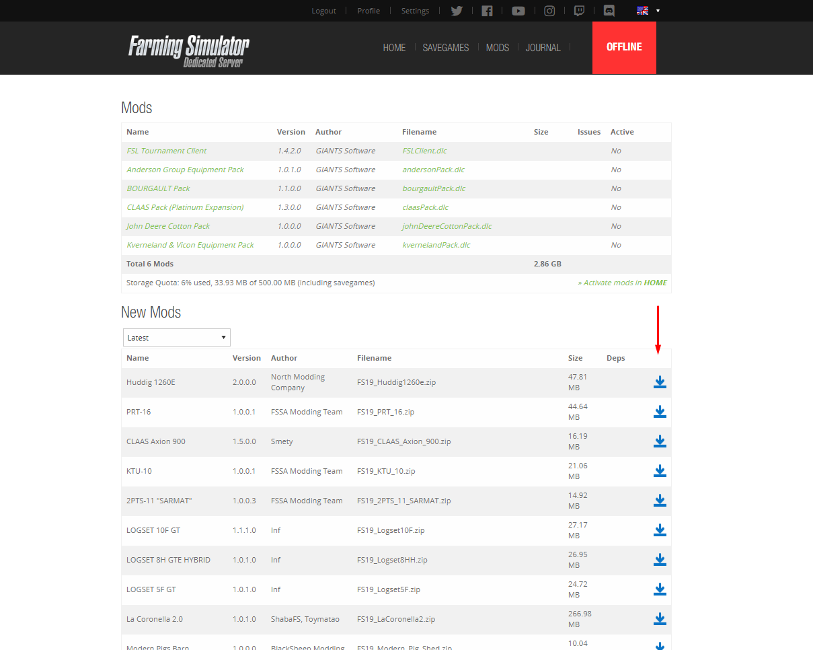
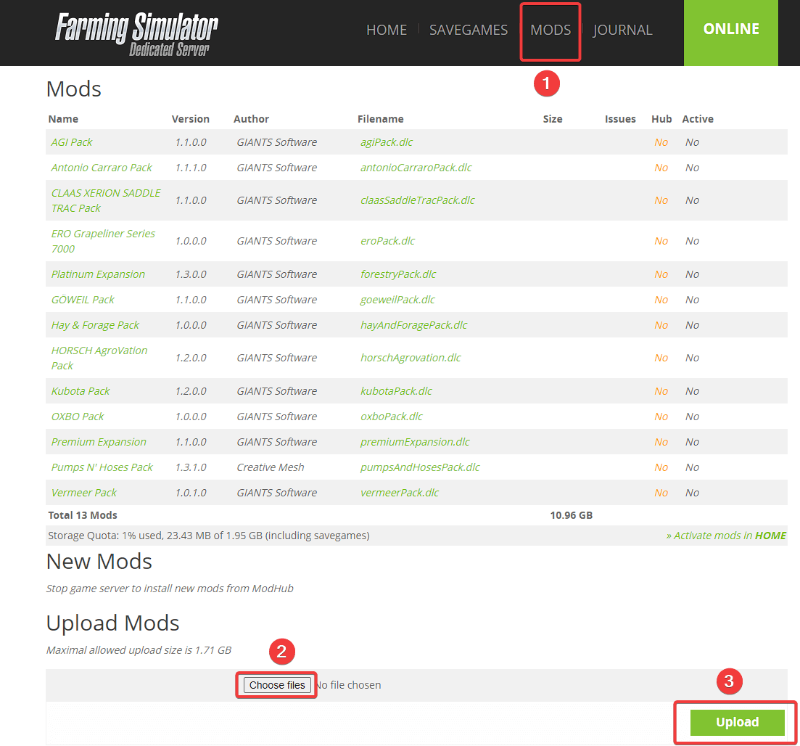
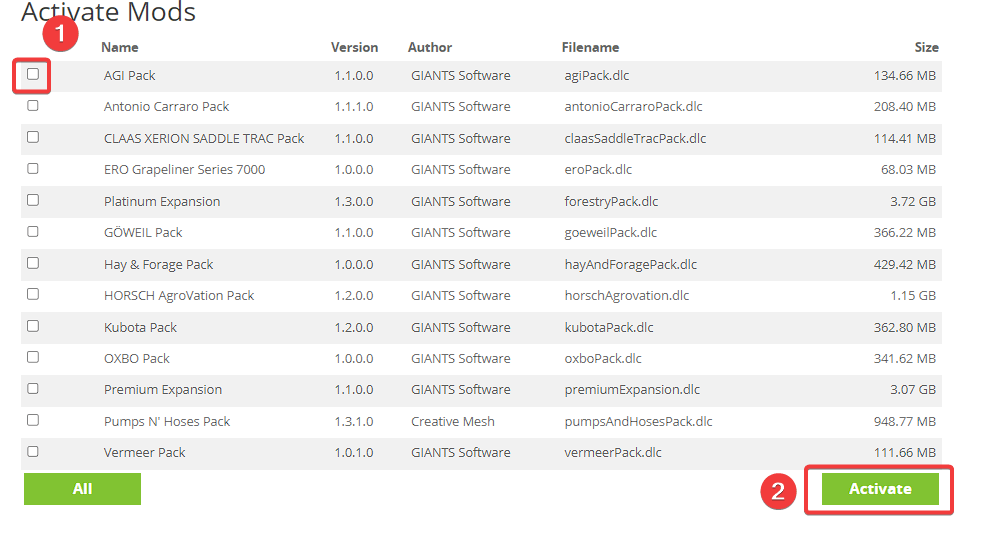
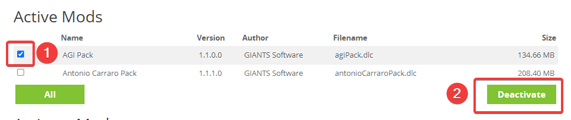
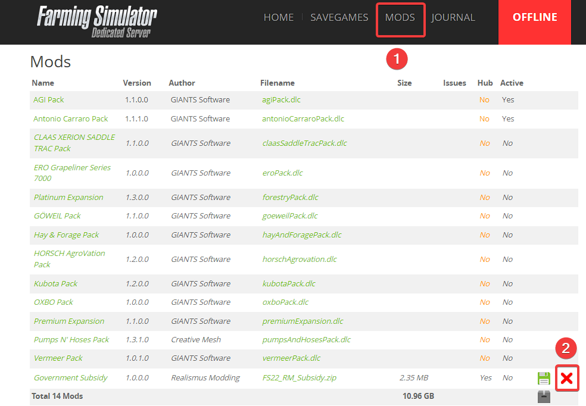

Installing mods
===============

There are few ways how you can install mods to your FS22 server.

After the mods are installed, they still need to be activated. This can be done under the "Home" tab.

  

Automatic installation
----------------------

To manage the mods on the automatic download feature, simply click the download button to start the download of the desired mod

Mods that are found here are directly managed by Giants, so the version of the mods should always be up to date. 

Manual installation
-------------------

You can upload mods manually to your server by using FS22 Control Panel or FTP client.  
To upload mods via FS22 Control Panel, simply navigate to `Mods` tab and you will see an option to "Upload mods" at the bottom of the page. Select the .zip archive of the mod on your PC and upload it!  The usual location for mods' archives on PC is `C:\Users\yourUser\Documents\My Games\FarmingSimulator2022\mods` directory.

> If you have mod that is larger than  1.71 GB, you will need to use FTP method of uploading mods.
For more informations on how to manually install mods via FTP refer to this article: [How to manage your Farming Simulator 22 server files using FTP (File transfer protocol)](manage-files-via-ftp.md).

Activating, disabling and uninstalling Mods/DLCs
-------------------------------
> All official Farming Simulator 2022 DLCs are included in server and cannot be uninstalled (only disabled). Note that if you activate DLC, you need to have DLC active from your side to be able to join the server. 

After uploading mods to the server, you will usually need to activate them. To do this, you should go to **Home** page of your FS22 server and scroll down until `Activate Mods` section.

In case you want to disable the mod, navigate to **Home** page. Find the `Active Mods` section, select the ones you want to disable and press **Deactivate** button.  
  

In case you want to completely remove the Mod that has been taking your Mod space, navigate to **Mods**. Simply press the red X near the mod that you want to completely remove from your server.  

Keep in mind that the server must be stopped before disabling or uninstalling the mods!