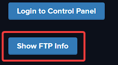
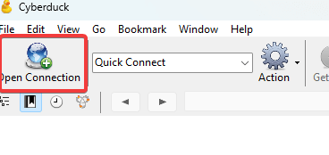
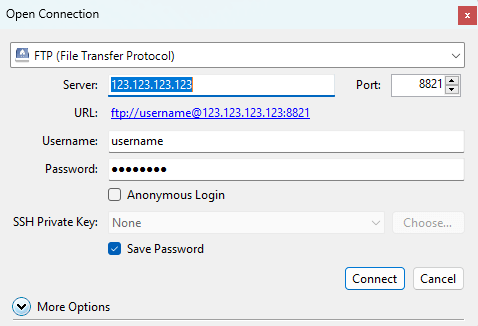
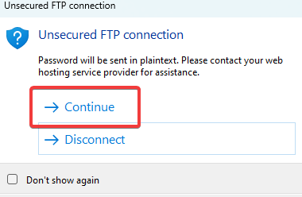
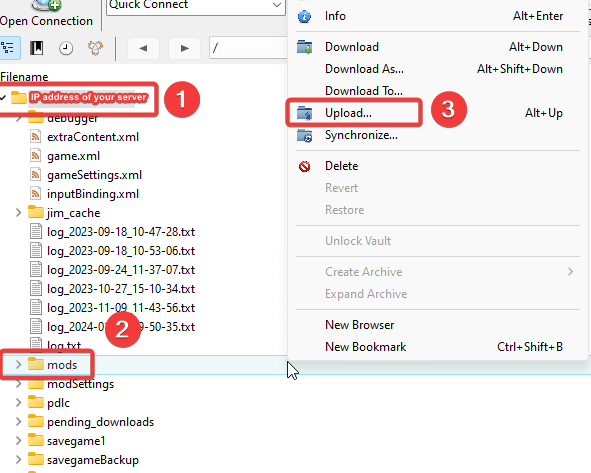

Unlike the other games, where we offer full FTP access to server files, FS22 FTP access is limited as per developer demands. As such, the only folder we provide access to via FTP is the `/ServerProfile` directory.

  
Connecting to your FTP Account
=================================

You can follow these steps to access and manage your server files using FTP :

1.  Download and install an FTP client of your preference such as Cyberduck, FileZilla, WinSCP etc. In this article, we will show an example from [Cyberduck](https://cyberduck.io/).

2.  Connect to your FTP account using the details shown in [your billing area](https://clients.fragnet.net/clientarea.php?action=products) if you click on your active Farming Simulator 22 server => click on `Show FTP Info` button. 

    Server : Your game server address  
    **Warning** : Do not include the port after the IP address (I.E 192.168.1.1 instead of 192.168.1.1:25565)  
    Port : 8821 
    Username : Your username  
    Password : Your password  

Use those credentials to fill in the field in your FTP client then click on "quick connect"

> Be careful when you type this information as you may get a 15 minutes ban if you attempt to login with the wrong credentials repeatedly. In that situation, simply disconnect and wait 15 minutes before trying again. 

If you receive warning regarding unsecured FTP Connection, you can ignore it and click on **Continue** option.

Uploading and downloading files or folders
==========================================

FTP is particularly useful for backing up your server files, or uploading plugins/worlds/settings onto your server.  
  
Once connected to your FTP account, you will see folder with the IP address and port of your server. 
You can upload, download, and move files from your computer to your server and vice versa, as well as within the server's folders.  For example, if you would like to upload mods, you can right click on **mods** folder and select `Upload...` function from the menu. 
  
  
  
Alternatively, you can drag and drop files. 