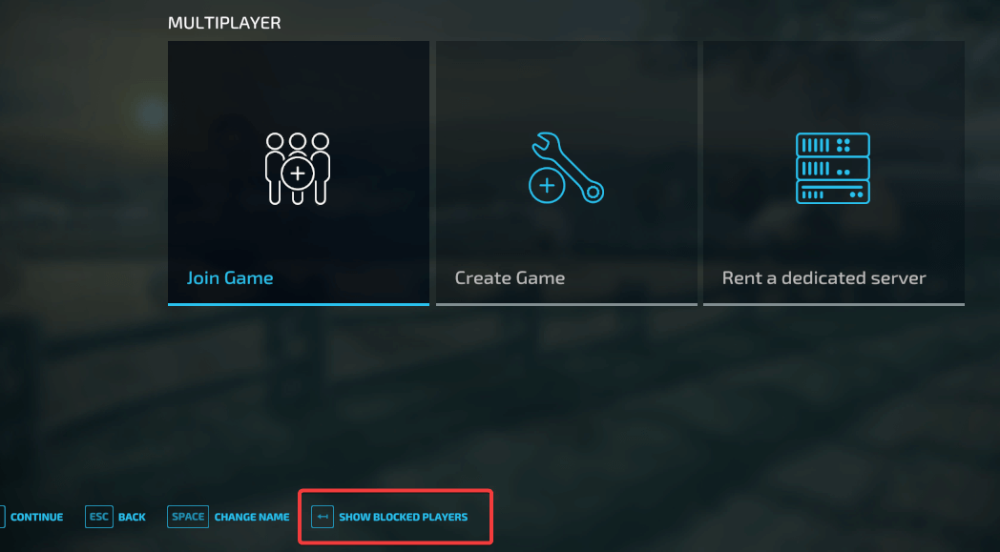
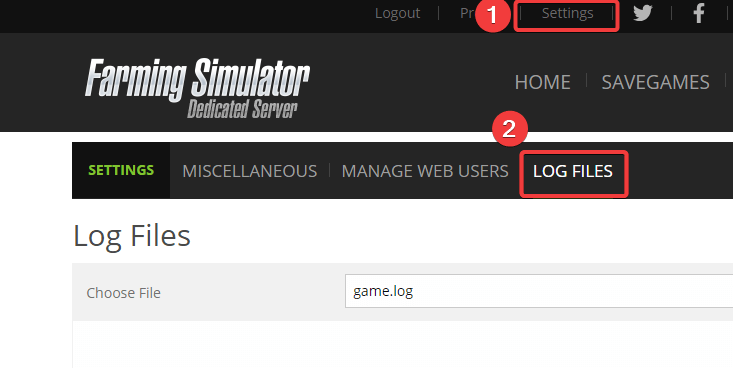
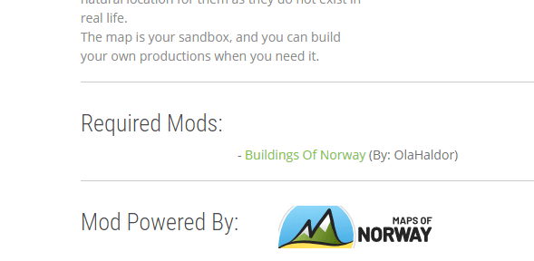

# Overview of common problems

## Unable to find my FS22 server

1. Ensure your game runs the latest available version of Farming Simulator 22. 

2. Check if you have not blocked the server.
You can see blocked servers in ```Blocked players``` option in ```Multiplayer```. 


3. Wait 5-10 minutes from the startup time of your server. 

4. Refresh the server list by going back to ```Multiplayer``` menu and selecting ```Join Game``` option. 

4. Check your **game.log** file for any errors in ```Settings``` => ```Log Files``` option.


If you see an error:
```
Error: Could not start dedicated server with current mod setup because some dependencies are missing!
``` 
check all the **Active** mods on the server for any dependency mods that are required for some mods to run.  All the required dependencies have to be uploaded to your server and activated. 

For example, if you have active mod map **Rennebu**, the dependency for it is ```Buildings Of Norway```. All the dependencies for Modhub mods appear in ```Required Mods``` section.


If you have trouble finding the missing dependencies, reach out to us and we can help you with it!

## My server does not save

1. Check your **game.log** file for any errors in ```Settings``` => ```Log Files``` option.


If you see the following warning:
```
Warning: Saving while already saving
```
you will need to increase save interval in **Configuration** in Control Panel. The warning means that the save interval is too short and the new save process interrupts the ongoing save process which leads to the corruption of the savegame.

2. Ensure that you don't have active ***SuperPerson*** mod as it tends to corrupt the savegame.

3. Update all mods to the latest available versions.