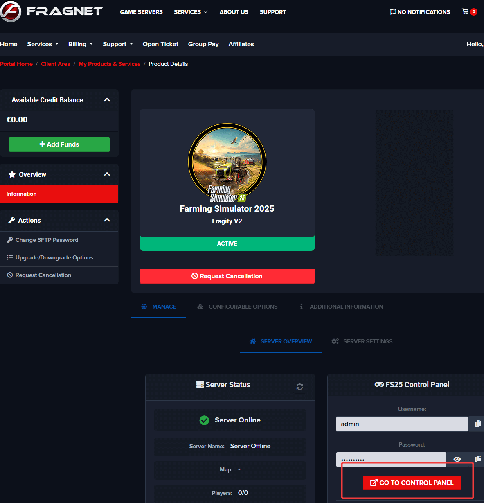
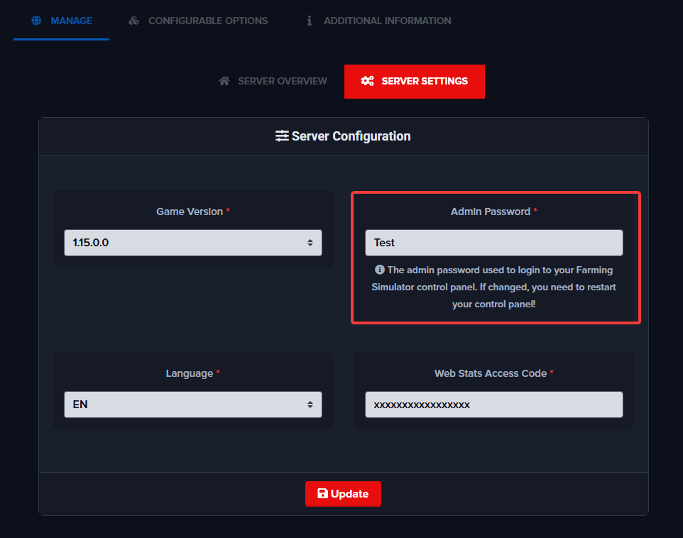

# Accessing Your Control Panel

This guide explains how to locate and access the **control panel** for your Farming Simulator 2025 server, where you can start, stop, configure, and manage your server's settings.

---

## Step 1: Log in to the Client Area

Navigate to the Fragnet client area: [clients.fragnet.net](https://clients.fragnet.net/clientarea.php)

If you have issues logging in, we recommend resetting your password or contacting our support.

---

## Step 2: Go to Services

Click on **Services** in the navigation menu.

---

## Step 3: Select Your Server

Select your active FS25 server from the list.

You should see the login to control panel link and the credentials that can be used on the login page.

---

## Changing Your Control Panel Password

To change the password for your FS25 control panel:

1. Go to **Server Settings**
2. Set **Admin Password** to your preference
3. Click the **Update** button to save the password
4. Go back to the **Server Overview** tab
5. Click **Restart** from the Quick Actions menu to apply the new password

