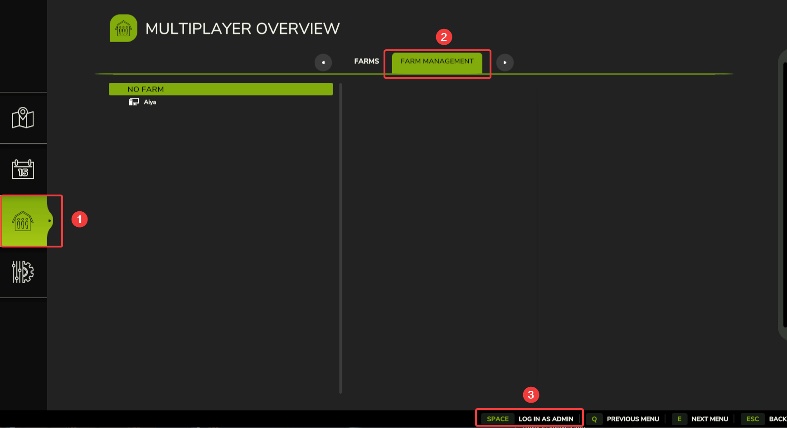

# Becoming an Admin

This guide explains how to become an **admin** on your **Farming Simulator 2025 server**.

---

## Step 1: Join Your Server

Once you find your FS25 server in the in-game browser, use the **Game Password** to join the server. The Admin password will only be needed after you've joined.

---

## Step 2: Log in as Admin

1. Navigate to **Multiplayer Overview** menu
2. Go to **Farm Management**
3. Click on the **Log in as admin** button
4. Enter the administrator password that is set in your FS25 control panel
5. Click **Log in as admin** again to confirm

If the password was entered correctly, you should now be an admin on your FS25 server!
