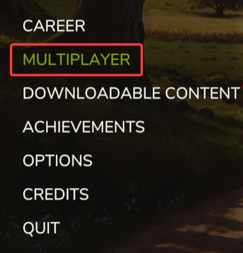

# Finding Your Server

This guide explains how to find and join your **Farming Simulator 2025 server**.

---

## Step 1: Launch the Game

Launch **Farming Simulator 25** and make sure your FS25 server is running from the FS25 control panel.

---

## Step 2: Go to Multiplayer

Go to **Multiplayer** and select **Join Game**.

---

## Step 3: Set Search Filters

Set the search filters to match the settings configured in your FS25 control panel.

---

## Troubleshooting

### Server Does Not Appear in the List

**FS25 server is offline**
- The server must be running in the FS25 control panel to appear in the list.

**Game version mismatch**
- Your FS25 version must match the server's version. You can see your game version in the top-left corner of the main menu.

---

### Still Cannot Find the Server?

1. Ensure that the search filters are set correctly
2. Restart the game and search again
3. Contact our support team for assistance
