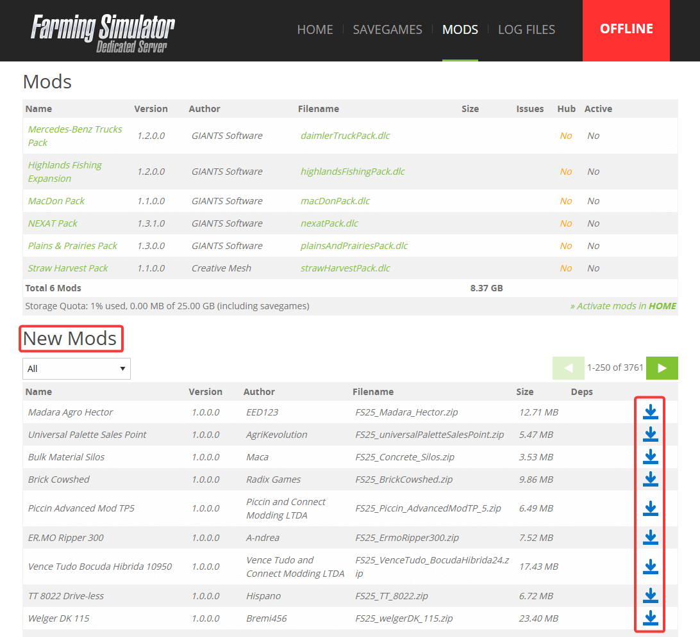
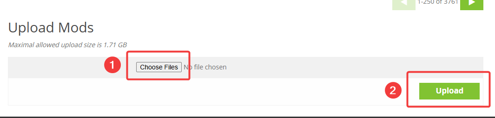
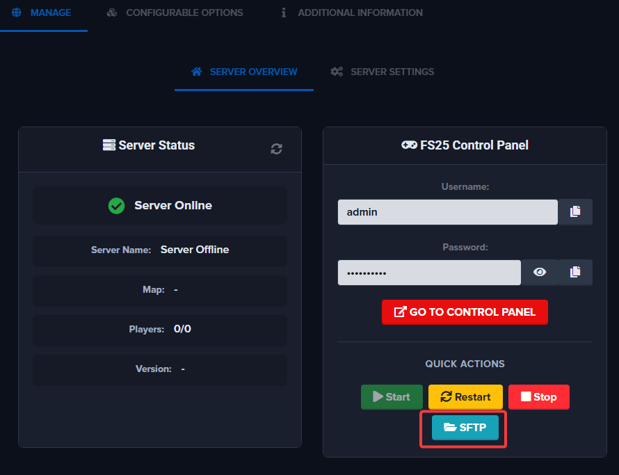
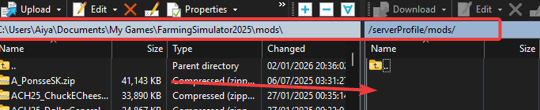
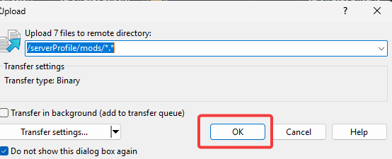
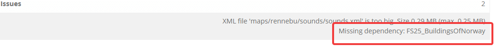
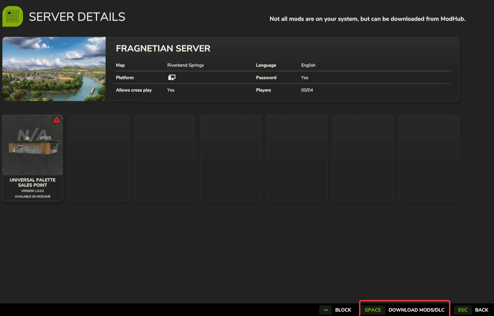

# Uploading Mods

This guide explains how to upload and manage **mods** on your **Farming Simulator 2025 server**.

---

## Where Can I Find FS25 Mods?

FS25 mods can be found on the official Modhub page: [farming-simulator.com/mods](https://www.farming-simulator.com/mods.php)

You can also use 3rd party websites for mods.

:::note
Mods must be in `.zip` format to be recognized in the FS25 control panel.
:::

You can also browse mods directly in the FS25 control panel under **Mods** tab => **New Mods** section. Click the upload icon next to any mod to install it.



---

## Where Can I Find My Local FS25 Mods?

On Windows, mods are stored in your Documents folder:

```
C:\Users\<YourUsername>\Documents\My Games\Farming Simulator 25\mods
```

To open this folder quickly:
1. Press **Win + R** to open the Run dialog
2. Type `%USERPROFILE%\Documents\My Games\Farming Simulator 25\mods` and press **Enter**


---

## Uploading Methods

You can upload mods via the FS25 control panel or via SFTP. If you need to upload several mods or mods larger than 1.71GB (current control panel limit), we recommend using SFTP.

### Upload via FS25 Control Panel

1. Log in to the FS25 control panel
2. Go to the **Mods** tab
3. Scroll down to **Upload Mods** section
4. Click **Choose Files** and select the mod you want to upload
5. Click **Upload**



---

### Upload via SFTP

You can use any SFTP client such as WinSCP, FileZilla, or Cyberduck. This example uses WinSCP.

**Step 1:** Locate your SFTP details on the page before logging into the FS25 control panel. Click the **SFTP** button to reveal the connection details.



**Step 2:** Launch your SFTP application (WinSCP in this example).

**Step 3:** Enter the connection details and click **Login**. If prompted to "Continue connecting to an unknown server", click **Accept**.


**Step 4:** Navigate to `serverProfile/mods` directory. Upload your mods from your PC to this folder. Click **OK** when prompted to confirm the upload.





---

## Activating Mods

1. Go to the main page of the FS25 control panel
2. Scroll down to **Activate mods** section
3. Click the checkbox next to the mod you want to enable
4. Click **Activate**


---

## Updating Mods

### Modhub Mods

1. Go to **Mods** tab in the FS25 control panel
2. Select **Update** from the dropdown under **New Mods** section
3. Click the upload button
4. Wait a few minutes, then restart the FS25 control panel from the Quick Actions menu


### Non-Modhub Mods

You will need to delete the existing mod and re-upload it via the Mods tab or SFTP.

---

## Troubleshooting

### Cannot Activate a Mod

The mod is missing a dependency. Go to the **Mods** tab and click **Issues** next to the mod to see the missing dependencies. Upload and activate the required mods first.




---

### Cannot Join Server Due to Mods

**For non-Modhub mods:** Download the mod to your local mods directory:
```
C:\Users\<YourUsername>\Documents\My Games\Farming Simulator 25\mods
```

To open this folder quickly, press **Win + R**, type `%USERPROFILE%\Documents\My Games\Farming Simulator 25\mods` and press **Enter**.

**For Modhub mods:** In-game, click **Details** on the server => **Download Mods/DLCs**



