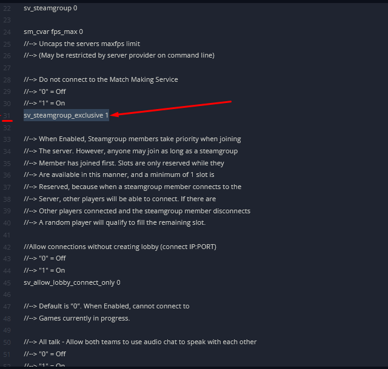

# Enabling matchmaking on Left 4 Dead 2 server
By default, our servers aren't open to matchmaking, meaning no other players can join via the **Quick Match** option in the game.

If you wish to have a server that's available to that option, follow these steps:

1. Go to your Fragify game panel and stop your server.

2. Navigate to File Manager.


3. Go to ```left4dead2  /cfg / server.cfg```.

4. Once there, go to line 31 in the server.cfg `sv_steamgroup_exclusive 0` and set it to 1 at the end looking like this: `sv_steamgroup_exclusive 1`.



5. Once edited, press **Save Content** located in the top right section of the window.


6. Start the server again, and now players can join your server via **Quick Match**.