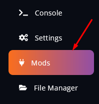
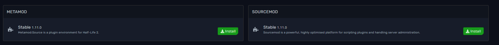

# Installing Metamod and Sourcemod on your Left 4 Dead 2 server
Due to our Fragify game panel, installing both mods is straightforward.

1. Navigate to the **Mods** tab.

2. Once there, click on **Install** on both mods, and the server will instantly install them.

3. Afterwards, Start/Restart your server, and you’re good to go.