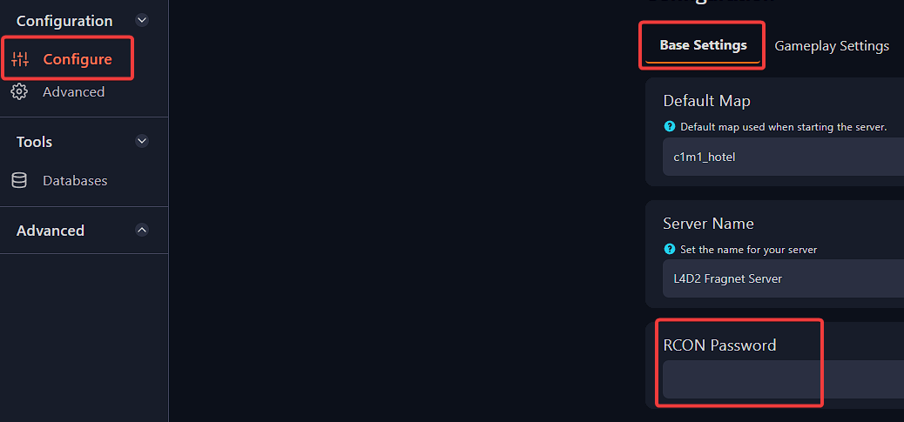

# Set and edit an RCON password for Left 4 Dead 2 server
Editing the RCON password is fairly simple with our gamepanel

Follow these steps to guide you on how to edit it.

Changing/Setting the RCON password:

1. Go to your Fragify Gamepanel   

2. Click on the **Configure** tab and find **RCON Password** in `Base Settings`.

3. Change/Set the RCON password to any you would like to have. Afterwards, restart the server for the change to be applied.

Removing the RCON password requires that the field in the **RCon password** window is blank.