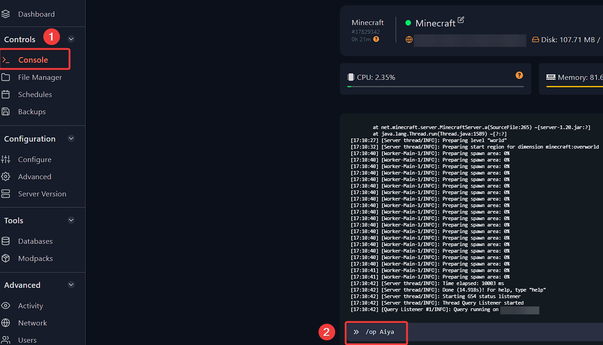
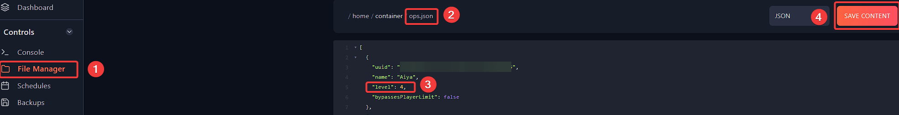

---
title: Becoming an admin (operator) on your Minecraft server 
keywords: ['minecraft server', 'minecraft add admin', 'minecraft add op', 'minecraft set admin', 'minecraft become admin', 'minecraft server add admin', 'minecraft server set admin', 'minecraft server become admin', 'minecraft']
--- 

# Becoming an admin (operator) on your Minecraft server 

You can grant OP permission to players using the Fragify panel console or via an in-game command by the user who is already an operator. 

1. Login to [your Fragify panel account](VAR::PANEL_URL) and select your server. 

2. Start your server, and once it is running, you can run in **Console** the following command:
```
/op yourUsername
```
This command will add the player with the set username to `ops.json` file.

If you would like to remove operator permission for the user, you can run this command in the console or in-game:
```
/deop yourUsername
```



## Permission Level
If you want to set operator permission levels, you can go to **File Manager** and click on the `ops.json` file.
You will see the following content:
```
[
  {
    "uuid": "1232378-342772-23432-82472-34237794724",
    "name": "yourUsername",
    "level": 4,
    "bypassesPlayerLimit": false
  }
]
```
You can change the level to:

`1` - Player can bypass spawn protection.

`2` - Player can use commands such as `/summon, /teleport, /tp, /xp, /setblock, /locate, /kill, /give` and player can use command blocks.

`3` - Player can use commands related to multiplayer management such as `/ban, /deop, /kick, /op, /whitelist`.

`4` - Player can use all commands.

Afterwards, you can use the **Save Content** button on the top-right side. 

