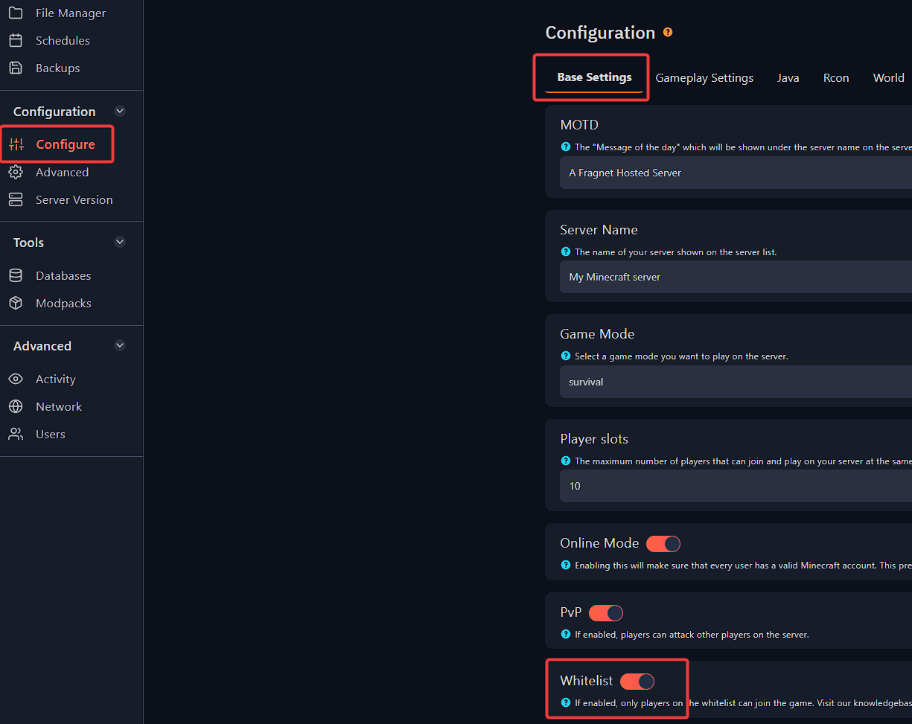
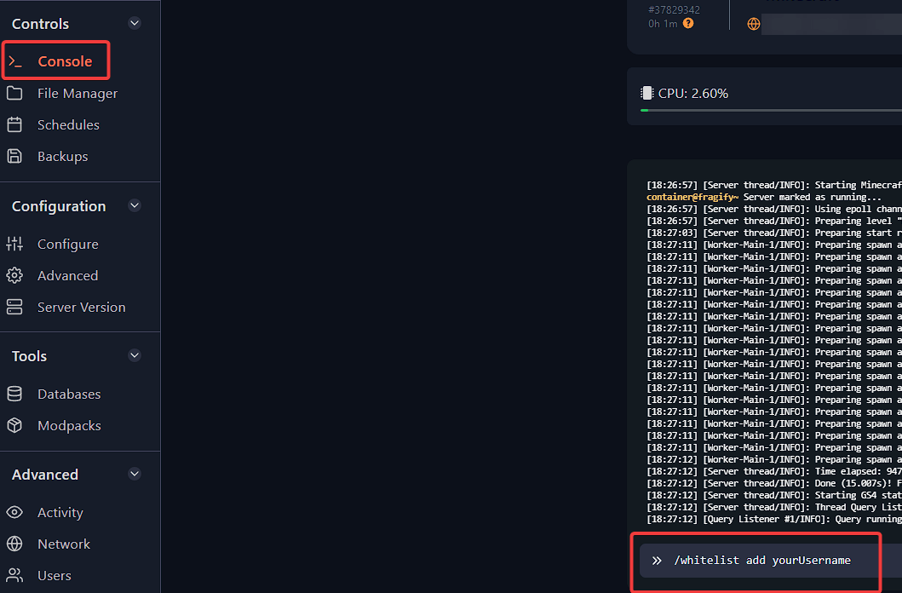

---
title: Creating whitelist on your Minecraft server
keywords: ['minecraft server', 'minecraft whitelist', 'minecraft server whitelist', 'minecraft', 'enable whitelist minecraft']
--- 

# Creating whitelist on your Minecraft server 

You can use whitelist function of your Minecraft server to allow only whitelisted players to join your server.

1. Login to [your Fragify panel account](VAR::PANEL_URL) and select your server. 

2. Navigate to **Configure** option on the left-side menu and look for **Whitelist** under `Base Settings`. You will need to enable it. 



3. Start the server and run the following command in-game as operator or in the console:
```
/whitelist add yourUsername
```
To remove person from the whitelist, you can use this command:
```
/whitelist remove yourUsername
```

