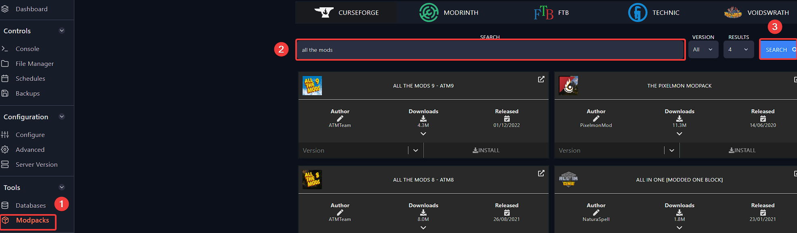
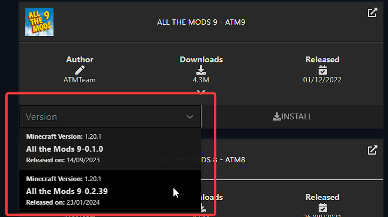
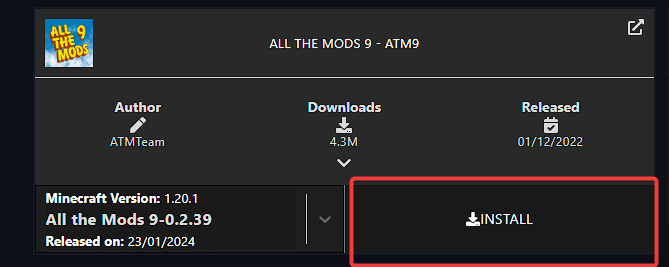

---
title: Adding modpack to your Minecraft server
keywords: ['minecraft server', 'minecraft add mod', 'minecraft add modpack', 'minecraft ftb', 'minecraft feed the beast', 'minecraft server add mod', 'minecraft server add modpack', 'minecraft server add modpack']
--- 

# Adding modpack to your Minecraft server

You can easily install modpacks on your Minecraft server in [Fragify panel](VAR::FRAGIFY_URL).

1. Login to your account and navigate to your server. You should see options on the left-side menu, and one of them will be **Modpacks** under the `Tools` section. 

2. After selecting the **Modpacks** option, you can search for the modpack you would like to install on the server. 

3. After finding the modpack you would like to install, you will need to select which version of the modpack you want.

4. click the **Install** button after setting the desired version.

Afterwards, the installation process of modpack will start once you attempt to start the server. Once the installation is completed, the server will start with the modpack included. 