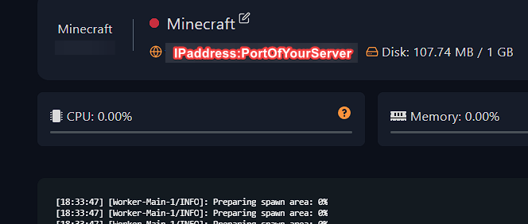
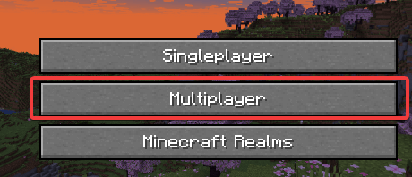
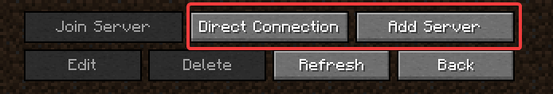
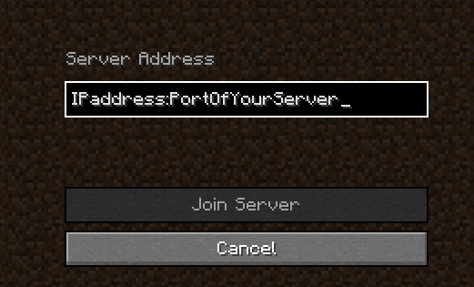
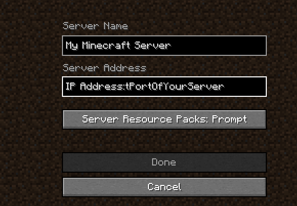

---
title: Connecting to your Minecraft server 
keywords: ['minecraft server', 'minecraft server', 'minecraft server connect', 'join minecraft server', 'minecraft']
--- 

# Connecting to your Minecraft server 

You can join your server via Direct Connection or by Adding it in-game. 
> Please note that you need to have the same version of your client-side Minecraft as your server's version. 

1. Login to [your Fragify panel account](VAR::FRAGIFY_URL) and select your server. 

2. You should see your server's IP address and port under your server's name.

3. Make sure that your server is running and launch Minecraft. Select the **Multiplayer** option in the main menu.

4. You can select either **Direct Connection** or **Add Server** option. 

5. If you have selected **Direct Connection**, you can input the IP address and the port of your server => Click on the **Join Server** button. 

If you have selected **Add Server**, you must input your server's name and IP address with port => Click on the **Done** button. Afterwards, you should see the server in the list, and you can click on it to connect. 

