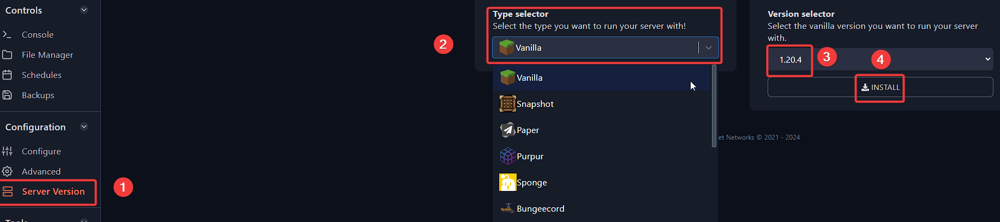

---
title: Switching server versions on your Minecraft server
keywords: ['minecraft server', 'minecraft server version switch', 'minecraft server change version', 'java version change minecraft', 'minecraft', 'minecraft server java version switch']
--- 

# Switching server versions on your Minecraft server

With the help of our panel, you can switch between different Minecraft versions easily. 

1. Login to [your Fragify panel account](VAR::PANEL_URL) and select your server. 

> We recommend making a backup of your Minecraft server before switching to another version.

2. Navigate to **Server Version** option on the left-side menu and select type of Minecraft under `Type Selector`. Afterwards, set the version that you would like to have under `Version Selector` and click on **Install** button.

