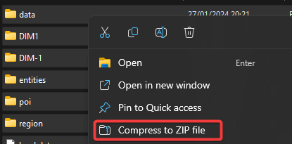
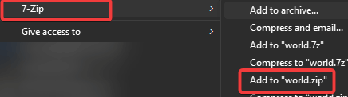
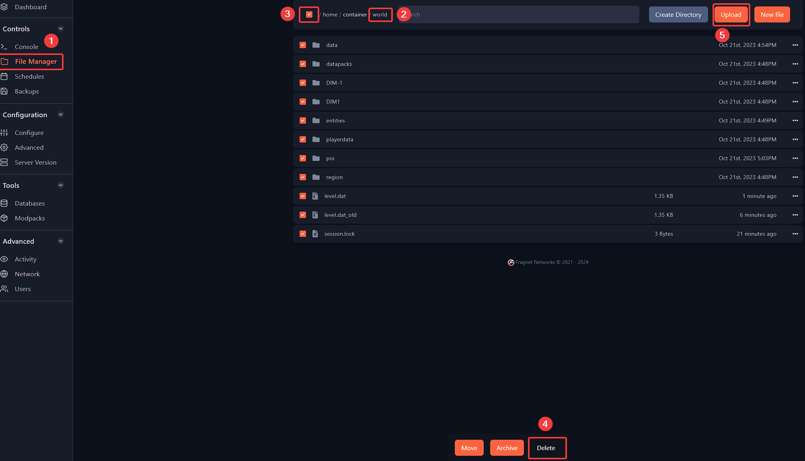
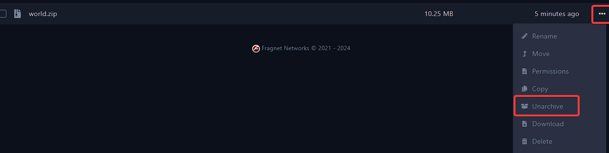

---
title: Uploading your local world to your Minecraft server
keywords: ['minecraft server', 'minecraft server world', 'minecraft world upload', 'load my world on minecraft server', 'minecraft']
--- 

# Uploading your local world to your Minecraft server

First of all, please ensure that your server runs the same modpack and version of Minecraft as your local world. 

1. Login to [your Fragify panel account]((VAR::FRAGIFY_URL)) and select your server. 

2. You will need to go to the folder where your world is located. The world folder usually will consist of `data, DIM1, DIM-1, region, leve.dat` files. Select all files by using shortcut on your keyboard **CTRL+A** and right-click to see menu with options. If you use Windows 11, you will see an option **Compress to ZIP file** which you can use.

Otherwise, you will need to have installed 7-zip which can be installed from [here](https://7-zip.org/download.html) and use 7-Zip to add files to zip archive. 

3. Go to **File Manager** and remove existing world files in `world` directory by selecting all the files and click on **Delete** button. Afterwards, you can use **Upload** button to upload your achive. Alternatively, you can drag and drop archive or use SFTP. Guide for SFTP can be found [here](../../fragify/file-manager.md).

4. After uploading zip archive, you will need to go to **File Manager** => `world` folder => click on **...** and select **Unarchive** option.

5. Start the server and if everything was setup previosly correctly (same version and same modpacks), the server will run. 