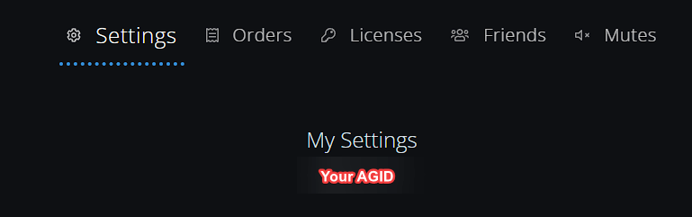
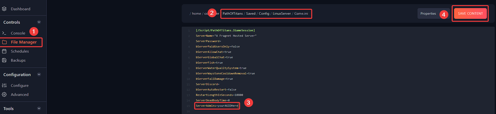

# Adding admins on your Path Of Titans server

First, you will need to know Alderon Games ID to add yourself or any other player as admin. 

## Find your Alderon Games ID (AGID)


> To find AGID, you can login to your account here: https://alderongames.com/login and go to https://alderongames.com/me/settings. AGID will be located under `My Settings`.  



> Alternatively, you can find your AGID in Alderon Games Launcher on the top-right side. 


## Adding AGID of admins to Game.ini
You can add or remove admins by using the following steps:

**Step 1:** Login to the [Fragify panel](VAR::FRAGIFY_URL) and select your Path of Titans server.

**Step 2:** Ensure that the server is stopped and navigate to **File Manager** on the left side menu. 

**Step 3:** Navigate to the following directory: `PathOfTitans/Saved/Config/LinuxServer`, and you will need to click on the **Game.ini** file to edit it.

**Step 4:** If doesn't exist, add `[/Script/PathOfTitans.IGameSession]`. Enter the Alderon Games ID(AGID) under it, and add one player per line. To remove admin, remove the line.


### Example of Game.ini
```
[/Script/PathOfTitans.IGameSession]
ServerAdmins=087-234-324
ServerAdmins=348-892-843
ServerAdmins=249-453-328
ServerAdmins=yourAGIDHere
;comments can be made by including semi-colon in the beginning
```
**Step 5:** Click on **"Save Content"** button and start/restart the server for the changes to be applied.

